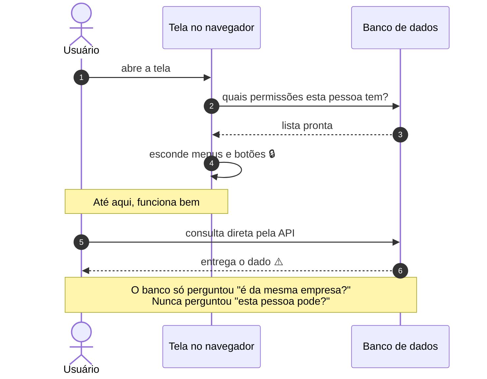
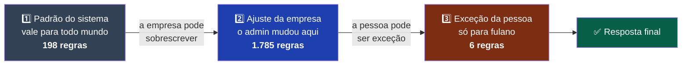
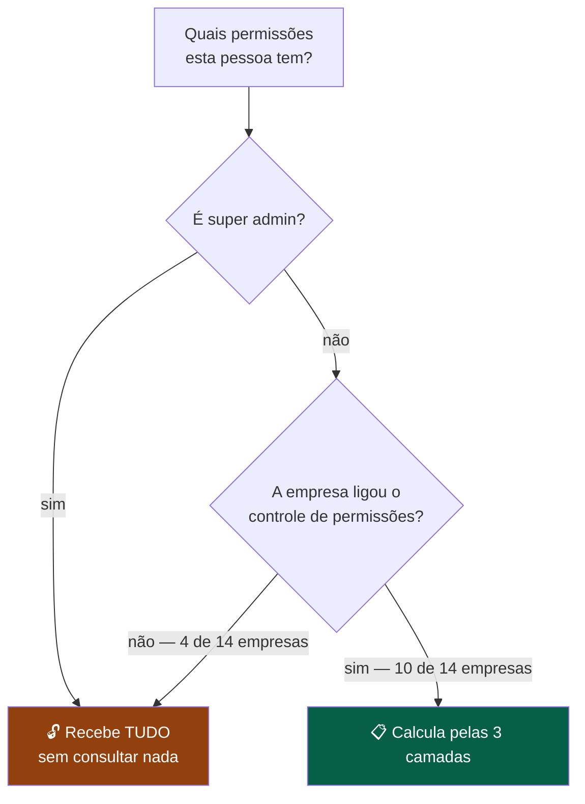
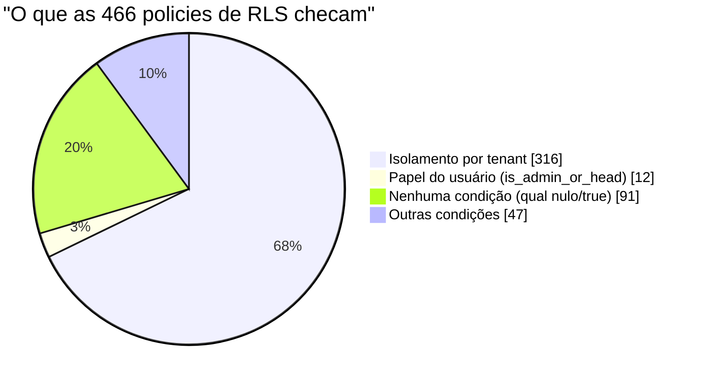

# RBAC atual do DoctorSaaS — como funciona hoje

> Levantado em **13/09/2026** direto do banco de produção (`vbngjzovjhkmietztffo`) e do código em `main`.
> Todos os números deste documento foram medidos, não estimados.

---

## 1. O resumo em cinco linhas

1. Existe um RBAC real, com **66 recursos cadastrados** e **três camadas de precedência** já funcionando.
2. Ele decide **o que aparece na tela**. Não decide **o que o banco devolve**.
3. Papel é um campo de texto com **3 valores fixos** (`admin`, `head`, `user`) — não dá para criar papel novo.
4. Está **ligado em 10 dos 14 tenants**. Nos outros 4, tudo é liberado.
5. **14 recursos aparecem na tela de permissões e não fazem absolutamente nada** quando alterados — 18 no total, 4 deles ocultos.

---

## 2. O desenho de hoje, em um diagrama



> **Leia assim:** os passos **1 a 4** são a experiência de uso — e funcionam bem.
> Nos passos **5 e 6** está o problema: quem pula a tela recebe o dado do mesmo jeito, porque a permissão nunca chegou ao banco.

---

## 3. As peças, uma a uma

### 3.1 `resources` — o catálogo do que pode ser trancado

| | |
|---|---|
| Linhas | **66** (62 visíveis na tela, 4 ocultas) |
| Tipos | 10 são navegação (`nav.*`), 56 são telas/ações internas |
| Hierarquia | campo `parent_key` (ex.: `clientes.custos` é filho de `clientes`) |
| Quem lê | qualquer usuário autenticado (é catálogo, não dado sensível) |

Chaves ocultas hoje: `lancamentos`, `receita_mrr`, `dashboard_financeiro`, `cfg.whatsapp`.

### 3.2 As três camadas de permissão



> **Leia assim:** quem falou **por último** vence. Se ninguém falou nada, a resposta é **não**.

Cada linha tem quatro colunas booleanas: `can_view`, `can_insert`, `can_update`, `can_delete`.

### 3.3 A regra de precedência (é a mesma do Azure DevOps)

```sql
COALESCE( user_permissions.can_view,        -- 1º: exceção da pessoa
          tenant_role_permissions.can_view, -- 2º: regra da empresa
          role_permissions.can_view,        -- 3º: padrão global
          false )                           -- 4º: na dúvida, nega
```

Traduzindo para português:

> **O mais específico vence o mais genérico. Quem não disse nada, herda. Quem não herdou nada, é negado.**

Um `false` explícito na camada da pessoa derruba um `true` da empresa. Isso é exatamente o "Deny explícito vence" do Azure DevOps — só que aqui já está implementado e já tem trilha de auditoria (`permission_audit`, **220 registros**).

### 3.4 Os dois atalhos que liberam tudo



> **Leia assim:** existem **dois atalhos** que entregam acesso total sem consultar regra nenhuma.
> O segundo é o que surpreende: **empresa sem RBAC ligado não é "sem permissão", é "com todas".**

⚠️ **`rbac_enabled = false` não significa "sem permissões". Significa "todas as permissões".** É o comportamento certo para não quebrar quem nunca configurou, mas precisa estar claro: **4 dos 14 tenants hoje têm acesso irrestrito a tudo que a tela oferece.**

---

## 4. Onde a permissão é aplicada no frontend

| Peça | Arquivo | O que faz |
|---|---|---|
| `usePermissions()` | `src/hooks/usePermissions.ts` | Chama a RPC, monta o mapa, expõe `can(recurso, ação)` |
| `RequirePermission` | `src/components/auth/RequirePermission.tsx` | Envolve uma rota. Sem permissão → tela "Acesso negado" |
| `ProtectedElement` | `src/components/auth/ProtectedElement.tsx` | Envolve um botão. `mode="hide"` some, `mode="notify"` avisa no clique |
| `SettingsSidebar` | `src/components/configuracoes/SettingsSidebar.tsx` | Mapa `SECTION_TO_RESOURCE` com **37 abas** de Configurações |
| `RequireRole` | `src/components/auth/RequireRole.tsx` | Gate antigo, por papel — usado em apenas **2 arquivos** |

Duas decisões de UX importantes embutidas no código:

- **Enquanto carrega, libera** (`if (query.isLoading) return true`). Evita o botão "piscar" sumindo. O custo é uma janela de milissegundos em que o botão aparece para quem não tem acesso.
- **Super admin nunca é bloqueado** — `can()` retorna `true` antes de qualquer consulta.

---

## 3-A. A tela de permissões esconde 17 dos 66 recursos

`PermissoesPapeisContent.tsx` filtra o que exibe:

```ts
const CRUD_ENABLED = false; // esconde Inserir/Editar/Excluir
const SCREEN_ONLY  = true;  // mostra só nav.* , cfg.* e clientes.custos
```

Resultado medido: **45 recursos visíveis, 17 invisíveis** (mais 4 ocultos por `hidden`). Entre os que o admin **não consegue enxergar nem configurar**:

`clientes` · `clientes.exportar` · `clientes.modulos` · `clientes.oem_aprovacao` · `atendimento_chat` · `atendimento_filtros` · `atendimento_transferir` · `atendimento_grupo_participantes` · `usuarios_convites` · `usuarios_roles` · `super_monitor` · `dashboard_operacional` · `dashboard_conselho` · `whatsapp_instancias` · `parametros_atendimento` · `ia_configuracoes` · `base_conhecimento`

Duas leituras:

1. 🔎 **Correção:** não é verdade que "14 recursos aparecem na tela e não fazem nada" — só `nav.emails` aparece nessa situação. **O problema é o inverso:** recursos que existem, alguns funcionando (`clientes.exportar`, `clientes.modulos`), e o admin não os vê.
2. ✅ **Essas duas constantes são, na prática, um "nível de controle 1" já implementado** — e é sobre elas que a decisão D10 do plano se apoia.

---

## 4-A. O RBAC é o terceiro mecanismo de controle, não o primeiro

Medido em 13/09/2026, cada mecanismo contado separadamente:

| Mecanismo | Alcance | Configurável pelo admin? |
|---|---|---|
| `is_super_admin` embutido no componente | **67 arquivos** | ❌ |
| `profile.role === '…'` embutido no componente | **47 arquivos · 60 ocorrências** | ❌ |
| RBAC — `can()` / `ProtectedElement` | **26 arquivos** | ✅ |
| `RequirePermission` (rota) | 2 arquivos · 11 rotas | ✅ |
| `RequireRole` | 2 arquivos | ❌ |

**O controle de acesso real do DoctorSaaS hoje é código escrito à mão, espalhado por 47 arquivos, que nenhum admin consegue configurar.** O RBAC cobre menos da metade disso.

Isso explica por que trocar `role` por grupos não basta sozinho: os 47 arquivos continuarão comparando `profile.role === 'admin'` depois da troca. É a razão de existir a decisão D8 do plano.

### E não existe camada de API onde colocar a checagem

| Como a tela fala com o banco | Medido |
|---|---|
| Tabelas lidas diretamente | **146** (de 148) |
| Tabelas escritas diretamente | **36** · 118 operações |
| RPCs chamadas | apenas **46** |

A tela conversa com praticamente todo o banco via PostgREST. **Não há um backend intermediário** — logo, o RLS não é uma opção entre outras: é o único ponto onde a permissão pode ser imposta de verdade.

---

## 5. O que o banco realmente protege hoje

Medido nas **466 policies de RLS** em produção:



| Achado | Número | Leitura |
|---|---|---|
| Policies que checam **tenant** | 316 | ✅ O isolamento entre empresas é sólido |
| Policies que checam **papel** | 12 | ⚠️ Só `contratos` (update/delete via `is_admin_or_head()`) |
| Policies que consultam **`resources` / permissões** | **0** | 🔴 O RBAC não existe no banco |
| Policies abertas para `authenticated` | 5 | ✅ Verificado: são catálogos inofensivos — `cidades`, `estados`, `notification_event_types`, `resources`, `role_permissions` |
| Policies **`PERMISSIVE`** (somam com OU) | 446 | ⚠️ Uma policy permissiva nova **amplia** o acesso |
| Policies **`RESTRICTIVE`** (de fato limitam) | 20 | ✅ São as de escopo por unidade, em 5 tabelas |

> ⚠️ **A medição "48 de 66" é do frontend.** O banco tem guardas próprias que não passam pelo catálogo: `is_admin_or_head()` em `contratos`, `pode_decidir_oem()` em 10 funções de OEM, e o anti-lockout dentro de `update_tenant_permission`. Elas existem, mas são pontuais e escritas à mão — não é um sistema, é um conjunto de exceções.

**Conclusão honesta:** a segurança real do DoctorSaaS hoje responde **"de que empresa você é"**. Ela quase não responde **"quem você é dentro da empresa"**.

Na prática: um usuário `user` com o menu de Financeiro escondido continua conseguindo ler `movimentos_mrr` por uma chamada direta ao PostgREST, porque a policy só verifica o `tenant_id`.

---

## 6. O escopo de linha que já existe (e ninguém reaproveitou)

Este é o achado mais valioso do levantamento.

**Correção importante:** este mecanismo **não está preso a uma tabela**. Ele já roda em **cinco**:

| Tabela | Policies de escopo |
|---|---|
| `clientes` | 4 |
| `support_tickets` | 4 |
| `support_attendances` | 4 |
| `whatsapp_conversations` | 4 |
| `cac_despesas` | 4 |

São as **20 policies `RESTRICTIVE`** do banco (as outras 446 são `PERMISSIVE`). Tomando `clientes` como exemplo:


> **Leia assim:** o **Filtro 2** é o escopo de linha funcionando em produção hoje.
> É o mesmo conceito que a Bitrix24 chama de "ver só do meu departamento". Já roda em **5 tabelas** — falta apenas ligá-lo ao catálogo de permissões e acrescentar os critérios `setor` e `próprio`.

As funções `unidade_allowed(p_unidade bigint)` e `user_allowed_unidades()` fazem, para unidade base, **exatamente o que a Bitrix24 chama de escopo "do meu departamento"**.

⚠️ **Um detalhe técnico que vale mais que o resto desta seção.** Essas policies são declaradas `AS RESTRICTIVE`. No PostgreSQL, várias policies **permissivas** para o mesmo comando se combinam com **OU** — uma policy de escopo criada sem `AS RESTRICTIVE` **aumentaria** o acesso em vez de limitá-lo, e o erro seria **silencioso**: nada falha, o filtro simplesmente não filtra. Quem escreveu essas 20 policies acertou. Qualquer policy de escopo nova precisa seguir a mesma regra.

O padrão está pronto, testado e em produção em 5 tabelas. Falta um **critério a mais** (setor, próprio) e a ligação com o catálogo de permissões. Generalizar é continuar — não inventar.

---

## 7. Os cinco problemas concretos

### 🔴 P1 — 18 recursos não têm portão nenhum

Medição exata — **e o escopo dela é o frontend**: **48 dos 66 recursos** estão ligados a uma verificação em `src/` (`can(...)`, propriedade `resource=`, ou o mapa `SECTION_TO_RESOURCE`). Os outros **18 não são consultados por nenhuma linha de código de tela**:

`atendimento_chat` · `atendimento_filtros` · `atendimento_transferir` · `base_conhecimento` · **`clientes.oem_aprovacao`** · `dashboard_conselho` · `dashboard_operacional` · `ia_configuracoes` · `nav.emails` · `parametros_atendimento` · `super_monitor` · `usuarios_convites` · `usuarios_roles` · `whatsapp_instancias`

*(mais 4 ocultos, que ao menos não aparecem na tela: `lancamentos` · `receita_mrr` · `dashboard_financeiro` · `cfg.whatsapp`)*

**Repare no padrão: Financeiro, Usuários e Super Admin.** O admin desmarca, a tela confirma, e o acesso continua.

#### O caso `clientes.oem_aprovacao` — e uma correção honesta

🔎 **Correção de 13/09/2026:** uma versão anterior deste documento chamou este recurso de "puramente decorativo". **Estava errado, e o erro foi meu** — eu tinha varrido só o frontend.

O que existe de verdade, verificado no banco:

- ✅ A migration de **09/09/2026** cadastrou o recurso, **semeou `role_permissions`** e criou a função-guarda **`pode_decidir_oem()`**, que percorre a cadeia completa (pessoa → tenant → padrão global).
- ✅ Essa guarda é chamada por **10 funções de OEM** (`salvar_chave_oem`, `vincular_filial_oem`, `oem_reverter_lote`, `atualizar_custo_ds_oem`…). Ali a permissão **vale de verdade, dentro do banco**.
- 🔴 **As 3 RPCs da própria fila de aprovação — `fn_oem_aprovacao_aprovar`, `fn_oem_aprovacao_recusar`, `fn_oem_aprovacao_listar` — não chamam a guarda.** Nenhuma policy a usa.
- 🔴 A tela `AprovacaoOemTab.tsx` **não tem verificação nenhuma**.

Construíram a guarda certa, do jeito certo, e **não a plugaram na funcionalidade que dá nome ao recurso**. Existe **1 linha em `user_permissions`** concedendo esse acesso a uma pessoa — decisão consciente de alguém, que hoje não restringe ninguém na fila.

Este caso é de **09/09/2026**. É o exemplo mais recente — e mais útil — de por que o plano precisou ganhar um capítulo de governança.

### 🔴 P2 — Nenhuma policy de RLS consulta permissão

Já detalhado na seção 5. O cadeado é de tela.

### 🟡 P3 — Papel é texto livre com 3 valores

`profiles.role` é `text` **sem enum e sem CHECK**. Distribuição real hoje:

| Papel | Usuários |
|---|---|
| `user` | 47 |
| `admin` | 38 |
| `head` | 35 |
| `viewer` | **1** ← papel órfão que o frontend nem conhece |

Não existe caminho para criar um papel "Financeiro" ou "Suporte N2".

### 🟡 P4 — Módulos inteiros sem nenhum recurso

Rota existe, permissão não existe: **Onboarding & Implantação** (3 telas, gateadas só pela flag `onboarding_enabled` do tenant), **/cadastros**, **Contatos do WhatsApp**, **WhatsApp settings**, **/super/tenants**, **/super/templates**, **Meu Painel**.

O **Dashboard** é o caso mais grave: tem **8 abas** (Visão Geral, Crescimento, Cancelamentos, Vendas, Distribuição, Customer Success, Cohort, Meu Painel) e **zero cadeado funcional** — os 3 recursos de dashboard estão todos mortos.

### 🔴 P6 — O papel `viewer` deixa a pessoa trancada fora

Existe **1 usuário com `role = 'viewer'`**, no tenant **ASP**, que tem `rbac_enabled = true`.

`role_permissions` só conhece `admin`, `head` e `user`. Para `viewer` existem **zero regras**. Como a resolução termina em `COALESCE(..., false)`, essa pessoa recebe **`false` nos 66 recursos**.

Não é hipótese — é o comportamento de hoje, no seu próprio tenant. E é consequência direta de `role` ser `text` livre sem `CHECK`: nada impediu o valor de entrar.

### 🟡 P7 — A exceção individual ignora o tenant

Em `get_my_permissions()`, a junção com `user_permissions` é:

```sql
LEFT JOIN public.user_permissions up
  ON up.resource_key = r.key AND up.user_id = auth.uid()
```

A tabela **tem** a coluna `tenant_id` e ela **não é usada**. Se alguém mudar de empresa (ou tiver linhas de outra), as exceções antigas continuam valendo. Com 6 linhas o dano hoje é nulo — mas o defeito é real e deve ser corrigido na próxima alteração da função.

### 🟡 P5 — Não existe escopo de linha genérico

O único critério existente é **unidade base**, nas 5 tabelas acima. Não é possível expressar "o operador vê só os atendimentos dele" ou "o head vê só o setor dele" — falta o **critério**, não a estrutura.

---

## 8. Glossário

| Termo | No DoctorSaaS significa |
|---|---|
| **Recurso** | Uma tela, aba ou ação que pode ser trancada. Linha em `resources` |
| **Ação** | `view`, `insert`, `update`, `delete` |
| **Papel** | `admin`, `head` ou `user`. Campo texto em `profiles.role` |
| **Super admin** | Coluna booleana `profiles.is_super_admin`. **Não é um papel** — é um bypass |
| **Escopo** | Quais *linhas* você enxerga. Hoje só existe para unidade base, em `clientes` |
| **Tenant** | A empresa cliente. O isolamento entre tenants é o que de fato funciona hoje |

---

## 9. Como reconferir estes números

```sql
-- Contagens gerais
select
 (select count(*) from resources) as recursos,
 (select count(*) from role_permissions) as padrao_global,
 (select count(*) from tenant_role_permissions) as override_tenant,
 (select count(*) from user_permissions) as override_pessoa,
 (select count(*) from tenants where rbac_enabled) as tenants_com_rbac,
 (select count(*) from tenants) as tenants_total;

-- Postura do RLS
select
 count(*) filter (where qual ilike '%tenant%') as checam_tenant,
 count(*) filter (where qual ilike '%role%')   as checam_papel,
 count(*) filter (where qual ilike '%has_perm%') as checam_rbac,
 count(*) as total
from pg_policies where schemaname='public';
```

Para achar recursos mortos, buscar cada `key` de `resources` dentro de `src/`, ignorando `PermissoesPapeisContent.tsx` (que lista todos por definição).
