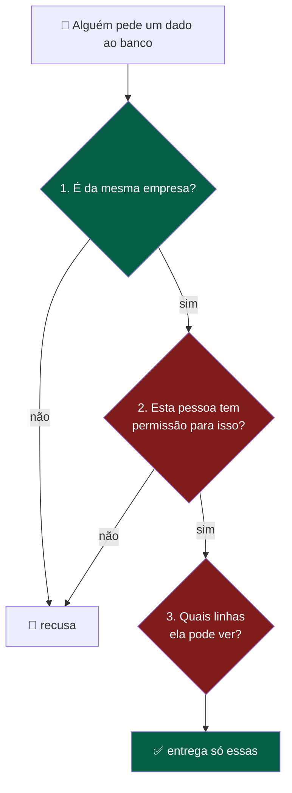
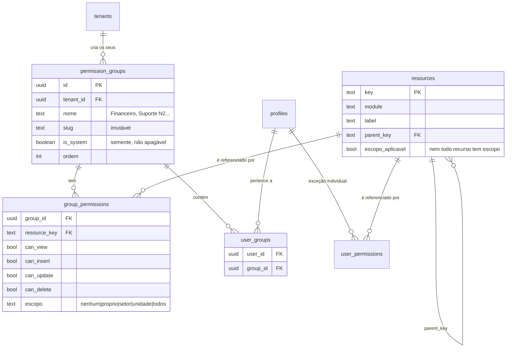
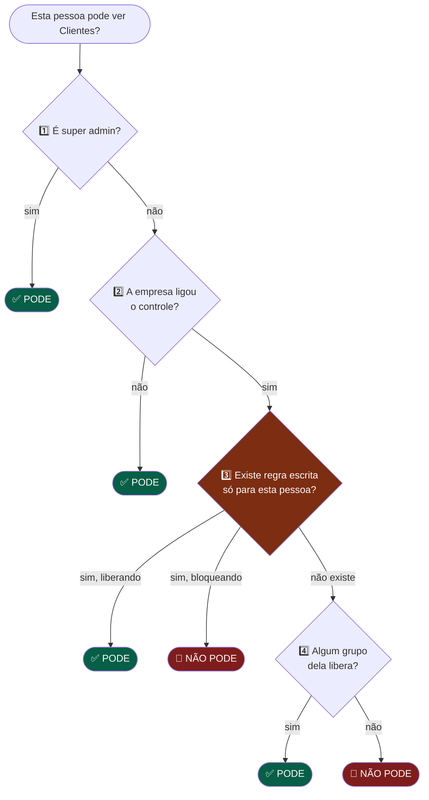
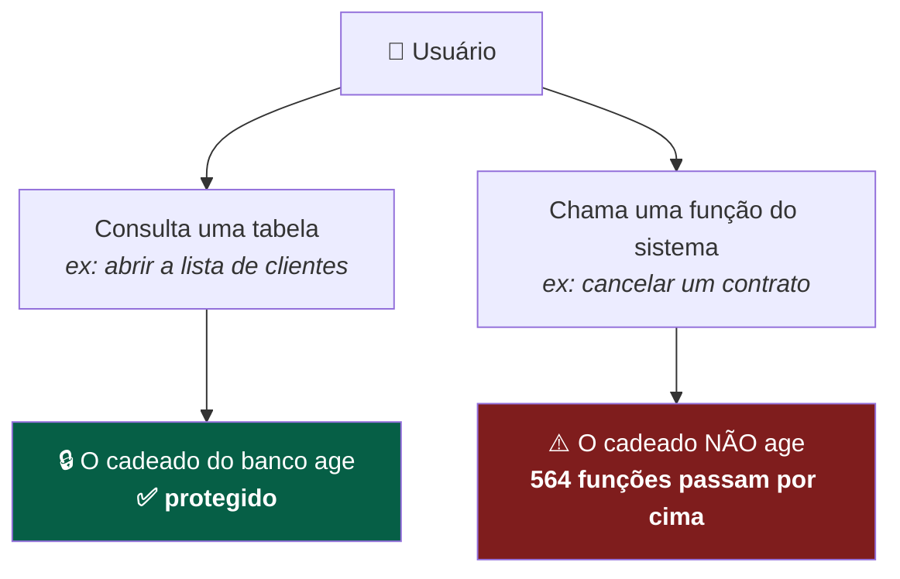
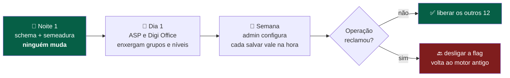
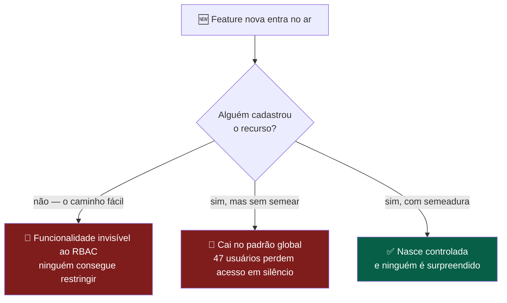
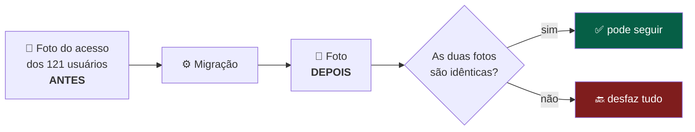

# Plano de implementação do RBAC do DoctorSaaS

> Pesquisa interna de **13/09/2026**, medida contra o banco de produção e o código em `main`.
> Documento de decisão — **nada aqui foi implementado.**

---

## 1. O problema em uma frase

O DoctorSaaS já sabe **quem é de qual empresa** (316 policies checam tenant).
Ele não sabe **quem é o quê dentro da empresa** (0 policies checam permissão).



> **Leia assim — as cores são o plano inteiro:**
> 🟢 **Pergunta 1 já existe** — 316 policies fazem isso hoje, e fazem bem.
> 🔴 **Perguntas 2 e 3 não existem** — zero policies. Todo este documento é sobre acrescentá-las.

**O React continua escondendo o botão — isso é experiência de uso.**
**O banco passa a recusar o dado — isso é segurança.** São coisas diferentes e as duas precisam existir.

---

## 2. Decisões de arquitetura

### ✅ D1 — Grupo substitui papel, sem quebrar nada

Hoje `profiles.role` é `text` livre com 3 valores (e 1 `viewer` órfão). Vira **grupo criável por tenant**, no modelo Jira: a permissão é dada ao grupo, e a pessoa entra no grupo.

### ✅ D2 — União, não Deny por grupo

Estar em dois grupos **soma** acesso (modelo Jira/Bitrix24), não subtrai (modelo Azure DevOps).

> **Por quê:** o Deny-por-grupo do Azure é tecnicamente superior e humanamente incompreensível — a própria Microsoft precisa de uma tela de "permissão efetiva" para explicar por que alguém perdeu acesso. E o DoctorSaaS **já tem o Deny no lugar certo**: `user_permissions`, que é mais específico e derruba o grupo.

### ✅ D3 — Escopo de lista fechada, não critério livre

Cinco escopos: `nenhum` · `proprio` · `setor` · `unidade` · `todos` (modelo Bitrix24), **não** regra por critério (modelo Movidesk).

> **Por quê:** escopo fechado vira `WHERE coluna = ANY(...)` — indexável. Critério livre vira expressão dinâmica e full scan. Em `whatsapp_messages` (387 mil linhas) isso derruba o banco. Performance é restrição de primeira classe neste projeto.

### ✅ D4 — Super admin fica fora do RBAC

Continua sendo bypass por `profiles.is_super_admin`. Não vira grupo.

> **Por quê:** se super admin fosse um grupo, alguém com permissão de editar grupos poderia se promover. Escalada de privilégio.

### ✅ D5 — O padrão `unidade_allowed()` é a base, não uma inspiração

As policies `unidade_scope_*` já implementam escopo de linha em produção — **e em 5 tabelas, não em 1** (correção de 13/09/2026): `clientes`, `support_tickets`, `support_attendances`, `whatsapp_conversations` e `cac_despesas`. São as 20 policies `RESTRICTIVE` do banco. O escopo novo **generaliza esse padrão**, não substitui — e a F5 é menor do que a primeira versão deste plano supunha.

### ✅ D10 — Nível de controle por módulo (1 · 2 · 3)

O catálogo fica **completo** (~185 recursos). Quem decide quanto disso aparece é o admin, escolhendo um **nível por módulo**.

| Nível | Mostra | Custo de banco |
|---|---|---|
| **1 — Normal** | navegação + configurações (~45 recursos) — **exatamente a tela de hoje** | zero |
| **2 — Moderado** | + módulos e ações sensíveis (💰 🔒 ⛔) + `excluir` nos críticos | policies de permissão nas tabelas sensíveis |
| **3 — Completo** | + abas, sub-ações, CRUD completo e **escopo por linha** | + policies de escopo e índices |

> **Isto já existe no código, travado.** `PermissoesPapeisContent.tsx` tem `SCREEN_ONLY = true` (mostra só `nav.*` e `cfg.*`) e `CRUD_ENABLED = false` (esconde inserir/editar/excluir). Essas duas constantes **são o nível 1**. A decisão D10 as transforma em configuração por tenant e por módulo. Medido: a tela mostra **45 dos 66** recursos; **17 são invisíveis** para o admin hoje, entre eles `clientes.exportar`, `usuarios_roles` e `atendimento_chat`.

**Duas regras que fazem o nível funcionar:**

1. **Nível por módulo, não global.** Uma empresa pode querer nível 3 em Atendimento (onde mora a LGPD) e nível 1 em Configurações. Nível único obrigaria a engolir 185 itens para ganhar granularidade em um lugar só.
2. **Baixar de nível materializa, não esconde.** Ao descer de 3 para 1, cada sub-recurso **recebe por escrito** o valor do pai, com tela de confirmação mostrando o que muda. O contrário — deixar a permissão fina valendo, invisível — cria "negação fantasma": o admin não consegue mais descobrir por que alguém está bloqueado.

**Como isto protege a performance:** o escopo de linha vive **só no nível 3**. Quem paga o custo é quem pediu. E vale a distinção que orienta tudo: **recurso é barato, policy é cara.** Um recurso custa +1 linha num mapa que roda 1× por sessão com 5 min de cache; só vira custo de banco quando alguém escreve uma policy — e isso segue restrito a 8–12 tabelas, tenha o catálogo 87 ou 185 itens.

### ✅ D9 — Os 3 papéis de hoje viram grupos **editáveis**, e são o ponto de partida

`Administrador`, `Gestor` e `Operador` nascem como grupos-semente. Eles são:

| | |
|---|---|
| Permissões | **totalmente editáveis** — inclusive as dos 3 |
| Nome | editável (o admin pode chamar de "Diretoria") |
| Excluir | **não** — são a base de compatibilidade |
| Nível base (D8) | **imutável** — é o que mantém as 27 funções antigas funcionando |
| Anti-lockout | o grupo de nível `admin` nunca perde `cfg.permissoes` nem `usuarios_roles` |

**Editar os 3 já funciona hoje, e isso é importante notar:** a RPC `update_tenant_permission` grava em `tenant_role_permissions`, com verificação de admin **dentro do banco**, e registra em `permission_audit`. São as 1.785 regras próprias que os 10 tenants já têm. O que **não** existe hoje é criar, renomear e duplicar.

🔧 **O ponto exato que a F1 muda** é esta linha, dentro da RPC:

```sql
IF p_role NOT IN ('admin','head','user') THEN
  RAISE EXCEPTION 'Role inválida: %', p_role;
END IF;
```

É o portão fechado que impede grupo novo. A F1 troca `p_role text` por `p_group_id uuid`, mantendo a assinatura antiga funcionando durante a transição.

⚠️ **E há um defeito a corrigir junto:** o anti-lockout da tela trava `cfg.permissoes` e `cfg.acessos`; o do banco trava `usuarios_roles`. **As duas listas não têm uma chave em comum.** Unificar na F1, com o banco como fonte da verdade.

### ✅ D7 — Herança pai→filho: cascata na tela, resolução independente no banco

Decidido em 13/09/2026 (Opção B). Desmarcar um recurso-pai **desmarca e grava** os filhos na tela; o banco continua resolvendo cada recurso isoladamente.

> **Por quê:** hoje `parent_key` existe na tabela, é carregado pela tela e **não é usado para nada** — só há 1 caso no sistema (`clientes` → `custos`, `modulos`, `oem_aprovacao`). Sem cascata, o admin desmarca "Clientes" e acha que fechou "Custos e Margens" junto. Isso não morde hoje porque sem o menu não se chega à tela — **mas morde a partir da F4**, quando o banco passa a responder por conta própria. Cascata só na tela mantém a expectativa do admin sem criar acesso implícito no banco.

### ✅ D8 — Todo grupo carrega um "nível base" (`admin` / `head` / `user`)

Um grupo novo como *Financeiro1* precisa declarar de qual dos três níveis ele deriva, e esse valor continua sendo gravado em `profiles.role`.

> **Por quê — e este é o achado que mais muda o plano:** **27 funções do banco leem `profiles.role` diretamente**, entre elas `is_admin_or_head` (usada nas policies de `contratos`), `is_tenant_admin`, `pode_decidir_oem`, `can_request_conselho_analise`, `fn_can_manage_scheduled_message`, `reativar_cliente`, `schedule_attendance`. Nenhuma delas sabe o que é grupo.
>
> Sem o nível base, criar *Financeiro1* produziria uma pessoa que **passa no RBAC novo e é recusada pelas 27 regras antigas** — ou o contrário. Com ele, o sistema antigo continua funcionando exatamente como hoje enquanto o novo assume por cima. Migrar essas 27 para `has_perm` é trabalho posterior, fora do escopo das F1–F6.

### ✅ D6 — Um grupo por usuário

Decidido em 13/09/2026. Sem regra de combinação, sem tela de permissão efetiva, e a resolução continua sendo um `COALESCE` simples. A tabela `user_groups` nasce N:N mesmo assim, para que virar multi-grupo depois seja mudar a consulta, não a estrutura.

<details>
<summary>Comparação que levou à decisão</summary>

| | Um grupo por usuário | Vários grupos |
|---|---|---|
| Complexidade | Troca direta do `role` | Precisa de regra de combinação |
| Tela de permissão efetiva | Desnecessária | **Obrigatória** |
| Consulta | 1 join | `EXISTS` + agregação |
| Suporte | "seu grupo é X" | "vem do grupo A, mas o B nega" |

</details>

---

## 3. Modelo de dados alvo



**O que muda nas tabelas existentes**

| Tabela | Mudança |
|---|---|
| `resources` | ganha `escopo_aplicavel boolean` e `escopos_validos text[]` |
| `role_permissions` | vira semente de `group_permissions`. **Mantida** durante a transição |
| `tenant_role_permissions` | migra para `group_permissions`. **Mantida** durante a transição |
| `user_permissions` | **intocada** — continua sendo a exceção individual, ganha só `escopo` |
| `profiles.role` | **intocada na F1.** Vira legado só quando tudo estiver migrado |
| `permission_audit` | ganha os eventos de grupo |

---

## 4. Como a permissão é resolvida



> **Leia assim — de cima para baixo, a primeira resposta vence:**
> 1. Super admin passa direto.
> 2. Empresa sem controle ligado passa direto.
> 3. **Regra individual manda** — inclusive para bloquear alguém que o grupo liberaria.
> 4. Senão, vale o **melhor acesso** entre os grupos da pessoa.
> 5. Ninguém disse nada? **Nega.**
>
> *(Durante a migração existe um degrau extra entre 4 e 5, lendo as regras antigas por papel. Ele some ao fim da F2.)*

A cadeia lida em português:

> **Super admin passa. Tenant sem RBAC passa. A exceção da pessoa manda — inclusive para negar. Senão, vale o melhor acesso entre os grupos da pessoa. Na dúvida, nega.**

---

## 5. A parte de banco — e a armadilha de performance

### 5.1 O truque que já existe no projeto

Uma função chamada dentro de uma policy corre o risco de rodar **uma vez por linha**. Em `whatsapp_messages` isso é 387 mil chamadas.

A solução é envolver em `(SELECT ...)`, o que faz o Postgres avaliar **uma vez por consulta** (InitPlan):

```sql
-- ❌ roda por linha
USING ( has_perm('atendimento_chat', 'view') )

-- ✅ roda uma vez por consulta
USING ( (SELECT has_perm('atendimento_chat', 'view')) )
```

**Isto não é teoria: 254 das 466 policies do DoctorSaaS já usam esse padrão** (`( SELECT is_super_admin() )`, `( SELECT current_tenant_id() )`). O plano só continua o que já está estabelecido.

### 5.2 As funções novas

| Função | Retorno | Como é usada |
|---|---|---|
| `has_perm(resource, action)` | `boolean` | `STABLE`, `SECURITY DEFINER`, `SET search_path = public` |
| `perm_scope(resource, action)` | `text` | devolve `todos`/`unidade`/`setor`/`proprio`/`nenhum` |
| `my_departments()` | `uuid[]` | lê `support_department_members` (113 linhas hoje) |
| `my_unidades()` | `uuid[]` | reaproveita `user_allowed_unidades()` **que já existe** |

Todas com `REVOKE FROM PUBLIC` + `GRANT TO authenticated, service_role`, conforme o padrão do projeto.

### 5.3 Como uma policy com escopo fica

🔴 **Correção de 13/09/2026 — a primeira versão deste plano trazia esta policy sem `AS RESTRICTIVE`, e isso estava errado de um jeito perigoso.**

No PostgreSQL, várias policies **`PERMISSIVE`** para o mesmo comando se combinam com **OU**. A tabela `whatsapp_conversations` já tem 4 policies permissivas. Uma policy de escopo adicionada como permissiva não filtraria nada — ela **somaria** acesso, e **sem erro nenhum**: a consulta funciona, o filtro simplesmente não filtra. O projeto já fez isso certo nas 20 policies de unidade, todas `RESTRICTIVE`.

```sql
-- 1) A permissão: restringe QUEM pode ler a tabela
CREATE POLICY chat_perm_select ON whatsapp_conversations
AS RESTRICTIVE FOR SELECT USING (
  (SELECT is_super_admin())
  OR (SELECT has_perm('atendimento_chat','view'))
);

-- 2) O escopo: restringe QUAIS LINHAS ele lê
CREATE POLICY chat_scope_select ON whatsapp_conversations
AS RESTRICTIVE FOR SELECT USING (
  (SELECT is_super_admin())
  OR CASE (SELECT perm_scope('atendimento_chat','view'))
       WHEN 'todos'   THEN true
       WHEN 'unidade' THEN unidade_allowed(unidade_base_id)
       WHEN 'setor'   THEN department_id = ANY (SELECT my_departments())
       WHEN 'proprio' THEN assigned_to = (SELECT auth.uid())
       ELSE false
     END
);
```

Duas policies separadas, e não uma só, porque são duas perguntas diferentes — e porque a de escopo pode ser ligada tabela a tabela sem mexer na de permissão.

> **Regra do projeto, sem exceção: toda policy de RBAC ou de escopo nasce `AS RESTRICTIVE`.** Uma revisão que só lê o `USING` e não olha o `permissive` deixa passar exatamente este erro.

Índices necessários antes de ligar (construídos `CONCURRENTLY`, via `execute_sql`, fora do pico):

- `whatsapp_conversations (tenant_id, department_id)`
- `whatsapp_conversations (tenant_id, assigned_to)`
- `support_tickets (tenant_id, department_id)`
- `support_attendances (tenant_id, assigned_to)`

⚠️ **Correção de 13/09/2026:** a primeira versão pedia um índice em `support_tickets (tenant_id, assigned_to)`. **Essa coluna não existe.** Verificado no banco: `support_tickets` tem `department_id` e `unidade_base_id`, não `assigned_to`. O dono de um ticket vive em `support_attendances.assigned_to`.

Consequência de projeto: em tickets, os escopos `unidade` e `setor` saem direto da tabela, mas **`proprio` exige junção com `support_attendances`** — mais caro e com índice próprio. Tratar `proprio` em tickets como entrega separada, depois dos outros dois.

Mesma armadilha em `whatsapp_messages`: a tabela só tem `conversation_id`. Qualquer escopo ali passa por subconsulta na conversa, sobre **387 mil linhas**. Decisão recomendada: **não aplicar escopo em `whatsapp_messages` na F5** — proteger a conversa é o que fecha o acesso na prática, já que a mensagem é sempre alcançada através dela.

### 5.4 🔴 O buraco que o RLS NÃO fecha

**564 das 652 funções do schema `public` são `SECURITY DEFINER`. Elas passam por cima do RLS por definição.**



> **Leia assim:** o cadeado do banco (RLS) vale para quem **lê tabela**.
> Quem **chama função** entra por outra porta — e 564 das 652 funções do sistema usam essa porta.
> Por isso blindar as policies não encerra o assunto: as funções sensíveis precisam perguntar por dentro.

**Consequência prática:** blindar as policies não basta. Toda RPC sensível precisa de um `has_perm()` no começo do corpo. As 564 precisam ser **triadas** — não reescritas.

Triagem proposta (esforço estimado: 1 a 2 dias só de leitura):

| Categoria | Ação |
|---|---|
| Leitura de dado sensível (MRR, chat, clientes) | adicionar `has_perm` |
| Escrita que muda dinheiro ou estado | adicionar `has_perm` |
| Trigger interno / helper puro | não mexer |
| Já tem guarda de tenant e papel | revisar, provavelmente não mexer |

> Precedente no projeto: as 35 RPCs fechadas em 31/07/2026 contra vazamento cross-tenant. A receita existe.

---

## 6. As fases

```mermaid
gantt
    title Sequência de implementação
    dateFormat X
    axisFormat %s
    section Sem risco
    F0 Sincerar a tela          :done0, 0, 1
    F1 Grupos (schema + tela)   :f1, 1, 2
    section Migração
    F2 Migrar papéis p/ grupos  :f2, 3, 2
    F3 Ligar os 18 sem portao   :f3, 5, 2
    section Segurança real
    F4 has_perm no RLS          :crit, f4, 7, 3
    F5 Escopo de linha          :crit, f5, 10, 3
    F6 Triagem SECURITY DEFINER :crit, f6, 13, 3
```



### F0 — Sincerar a tela (1 dia, risco zero)

Não é refactor, é parar de mentir. Marcar os **18 recursos sem portão** com um aviso na tela de permissões: *"ainda não aplicado"*.

🔴 **Correção de 13/09/2026: NÃO apagar `nav.emails` — por dois motivos.**

1. **As FKs são `ON DELETE CASCADE`.** Apagar um recurso apaga em silêncio todas as regras associadas nas três tabelas (`role_permissions`, `tenant_role_permissions`, `user_permissions`), sem confirmação e sem volta. O caminho certo é `hidden = true`, que é o que já foi feito com os outros 4 ocultos.
2. **Ele não é lixo — é feature em construção.** Existe uma migration de **10/09/2026** criando `email_accounts` e o recurso `cfg.email`. `nav.emails` é o item de menu que ainda não tem tela. Ocultar, e reativar quando a rota nascer (ver 6-A).

> **Por que primeiro:** hoje um admin desmarca `usuarios_roles` e acredita que trancou. Enquanto isso não for verdade, avisar é mais honesto do que consertar devagar.

### F1 — Grupos (3–4 dias)

Criar `permission_groups`, `group_permissions`, `user_groups`. Semear em cada tenant três grupos `is_system` — **Administrador**, **Gestor**, **Operador** — copiando exatamente o que `role_permissions` e `tenant_role_permissions` já dizem. Tela de CRUD de grupos.

Três defeitos existentes entram nesta fase, porque ela já mexe na função:

1. **Filtrar `user_permissions` por tenant.** A junção atual só usa `user_id` e ignora a coluna `tenant_id` que a tabela tem.
2. **Resolver o `viewer` órfão.** 1 usuário no tenant ASP está hoje com `false` nos 66 recursos, porque `role_permissions` não conhece esse papel. Ele precisa entrar num grupo real antes da migração.
3. **Fechar o papel com `CHECK`**, ou garantir que todo valor de `profiles.role` tenha grupo correspondente — foi a ausência de constraint que deixou `viewer` entrar.

**Critério de aceite: ninguém muda de acesso.** Um snapshot do `get_my_permissions()` de cada um dos 121 usuários antes e depois precisa ser idêntico — **exceto o `viewer`, que hoje está trancado e deve melhorar.** Essa exceção tem que ser declarada antes, senão o teste de regressão acusa falha legítima.

### F2 — Migrar (2 dias)

`get_my_permissions()` passa a ler grupos, com `role_permissions` como fallback. Leitura dupla. `profiles.role` continua existindo.

### F3 — Ligar os mortos (2–3 dias)

Colocar `ProtectedElement` / `RequirePermission` nos 18 recursos sem portão e cadastrar os ausentes — **≈21 recursos novos, não 75**, depois do critério de inclusão do inventário de funcionalidades.

🔴 **Item obrigatório da F3: remover o `RequireRole(["admin","head"])` de `/atendimento/dashboard`.** Hoje a rota tem portão duplo — mesmo concedendo `nav.atendimento_dashboard` a um operador, o `RequireRole` o barra. A tela de permissões oferece uma chave que não abre a porta.

🔴 **Correção de 13/09/2026 — esta fase tira acesso de 47 pessoas em silêncio se for feita sem cuidado.** Medido: o padrão global libera **65 de 66** recursos para `admin`, **48** para `head` e apenas **9** para `user`. Os 10 tenants com RBAC têm entre 174 e 183 das 198 regras próprias — **tudo que não está lá cai no padrão global**.

Consequência: cadastrar `dash.crescimento` e ligar o portão faz **todos os 47 usuários `user`** perderem a aba imediatamente, nos 10 tenants, sem ninguém ter decidido isso.

**Regra obrigatória da F3:** todo recurso novo entra com semeadura **explícita** nas três camadas, reproduzindo o acesso que as pessoas têm hoje. O padrão implícito não vale como decisão. Continua valendo fazer tenant a tenant, avisando antes.

### F4 — `has_perm` no RLS (4–5 dias) 🔴 **aqui começa a segurança**

Ordem pelas 9 prioridades do inventário de funcionalidades. Uma tabela por vez, **medindo antes e depois**, e **toda policy `AS RESTRICTIVE`**.

### F5 — Escopo de linha (4–5 dias)

`escopo` em `group_permissions` + índices + policies, **sempre `AS RESTRICTIVE`**.

As 4 tabelas quentes **já têm a estrutura de escopo montada** (as policies de unidade). A F5 acrescenta os critérios `setor` e `proprio` ao que existe, em vez de criar do zero. Ordem: `support_tickets` → `support_attendances` → `whatsapp_conversations`. **`whatsapp_messages` fica de fora** (ver 5.3).

### F6 — Triagem das SECURITY DEFINER (3–4 dias)

Conforme seção 5.4.

---

## 5-A. Publicação segura: a noite 1 e a primeira semana

> **Requisito do owner:** publicar e, no dia seguinte, **nada muda para ninguém**. O admin configura ao longo da semana. Só **ASP** e **Digi Office** ativos no início; os demais entram depois de aprovado.

### A linha de base que precisa ser preservada

Medida em 13/09/2026, quantidade de recursos visíveis por pessoa:

| Tenant | admin | head | user | observação |
|---|---|---|---|---|
| **ASP** | 65–66 | 48 | **10** | 1 `viewer` com 0 — **`status = inativo`**, não loga |
| **Digi Office** | 65–66 | 48–50 | **31** | já customizou: `user` vê 31 onde os outros veem 10 |
| Demais com RBAC | 65 | 26–48 | 10 | |
| DEMO · BM · DoctorSaaS | 66 | — | 66 | `rbac_enabled = false` ⇒ tudo liberado |

**O RBAC já restringe hoje.** Não se trata de "ligar" nada: trata-se de trocar o motor sem que o número mude.

### As 4 condições da garantia

| # | Condição | Por que é inegociável |
|---|---|---|
| **C1** | Flag **`rbac_v2_enabled`** por tenant, separada de `rbac_enabled`, **padrão `false`** | `rbac_enabled` já tem significado próprio (ligado em 10 de 14). Reaproveitá-la misturaria duas decisões |
| **C2** | O desvio pela flag mora **dentro de `get_my_permissions()`** | A função é única e global. Se o caminho novo não for isolado por dentro, os 12 tenants restantes mudam junto — publicar o frontend não os protege |
| **C3** | A tela nova (grupos, níveis) é **condicionada à mesma flag** | O deploy do frontend é um bundle só, para todos. Sem o condicional, os 12 veem tela de grupo sem grupo |
| **C4** | Semeadura **esparsa**: o grupo copia só as regras que o tenant já tem, mantendo o fallback | Materializar o valor resolvido congelaria o padrão global para aquele tenant — mudaria o comportamento futuro sem ninguém perceber |

### O teste de aceite da noite 1

Rodar **antes** e **depois**, e comparar:

```sql
-- Foto do acesso de cada pessoa (replica get_my_permissions)
with base as (
  select p.user_id, p.tenant_id, p.role, p.is_super_admin,
         coalesce(t.rbac_enabled,false) as rbac
  from public.profiles p join public.tenants t on t.id = p.tenant_id
)
select b.user_id, r.key,
  case when b.is_super_admin then true
       when not b.rbac then true
       else coalesce(up.can_view, trp.can_view, rp.can_view, false) end as pode_ver
from base b
cross join public.resources r
left join public.role_permissions rp
  on rp.resource_key = r.key and rp.role = b.role
left join public.tenant_role_permissions trp
  on trp.resource_key = r.key and trp.role = b.role and trp.tenant_id = b.tenant_id
left join public.user_permissions up
  on up.resource_key = r.key and up.user_id = b.user_id;
```

**Go/no-go:** `121 usuários × 66 recursos = 7.986 linhas`. O diff entre as duas fotos precisa ser **vazio**, sem exceção — inclusive o `viewer` inativo, que deve continuar com 0. Consertá-lo é mudança, e mudança não entra na noite 1.

### O que **não** entra na noite 1

| Fica de fora | Motivo |
|---|---|
| Ligar portão em recurso que hoje não tem | Tira acesso de gente. É a F3, tenant a tenant, avisando antes |
| Qualquer policy de RLS nova | É a F4. Muda o que o banco devolve |
| Escopo de linha | É a F5, e só no nível 3 |
| Corrigir o `viewer` do ASP | Está inativo. Vira item à parte, depois |
| Ocultar `nav.emails` | Muda a tela do admin. Custa nada esperar |

A noite 1 é **só schema + semeadura + flag desligada para 12 tenants**. Nenhuma linha de permissão resolvida muda de valor.

### A primeira semana



**Rollback = desligar `rbac_v2_enabled`.** Nenhuma fase apaga dado antigo: `role_permissions` e `tenant_role_permissions` seguem intactas e continuam sendo a fonte enquanto a flag estiver desligada.

⚠️ **Honestidade sobre prazo:** nada disso está implementado. A F0 é 1 dia e a F1 é 3–4 dias de trabalho. "Publicar essa noite" descreve o **desenho de segurança**, que está correto e é atingível — não o cronograma.

---

## 6-A. Governança: como uma feature nova entra no RBAC

> Esta seção responde à pergunta que mais ameaça o projeto: **o sistema está em desenvolvimento ativo. O que acontece com o RBAC a cada feature nova?**

### O problema, com números

Sem regra, toda feature nova cai em um destes dois destinos ruins:



O caminho do meio é o traiçoeiro. Medido: o padrão global libera **9 de 66** recursos para `user`. Recurso novo sem semeadura explícita **nasce negado** para os 47 usuários `user`, nos 10 tenants, sem ninguém decidir isso.

E o primeiro caminho é o que já vinha acontecendo: **apenas 4 das 163 migrations tocam `resources`**, para um catálogo de 66. O resto foi inserido direto em produção — mesmo padrão que o CLAUDE.md já descreve para o schema.

### A prova de que isso não é teórico

**09/09/2026, feature de Aprovação OEM.** Quem construiu fez quase tudo certo: migration cadastrando o recurso, `role_permissions` semeado, função-guarda `pode_decidir_oem()` escrita com a cadeia completa, intenção documentada em `COMMENT`.

E mesmo assim: **as 3 RPCs da fila de aprovação não chamam a guarda, e a tela não verifica nada.** A permissão foi concedida a uma pessoa e não restringe ninguém naquela fila.

Se acontece numa feature feita com esse cuidado, acontece em qualquer uma. O que faltou não foi capricho — foi **checklist**.

### A regra: 4 itens, e nenhum é opcional

Toda funcionalidade nova que mereça controle de acesso entrega:

| # | Item | Onde |
|---|---|---|
| 1 | **Recurso cadastrado na mesma migration da feature** | `resources`, com `INSERT … ON CONFLICT (key) DO UPDATE` |
| 2 | **Semeadura explícita nas 3 camadas**, espelhando quem tem acesso hoje | `role_permissions` + `tenant_role_permissions` |
| 3 | **Portão na tela** | `RequirePermission` (rota) ou `ProtectedElement` (botão/aba) |
| 4 | **Guarda no banco** | policy `AS RESTRICTIVE` **ou** `has_perm()` no corpo da RPC |

Os itens 1 e 2 **já são o padrão do projeto** — as migrations do OEM e de e-mail fazem exatamente isso. O que falhou nas duas foi o par 3 e 4.

> **Regra de ouro do item 2:** semear o que as pessoas têm **hoje**, nunca o que "faria sentido". Endurecer é decisão separada, feita depois, com aviso. Feature nova não é hora de tirar acesso de ninguém.

### Feature em construção: nasce oculta

Recurso de funcionalidade inacabada entra com **`hidden = true`**. Ele existe, as permissões já podem ser semeadas, e ele não polui a tela do admin nem promete o que ainda não faz.

É o caso de **`nav.emails` neste momento**: a rota não existe, mas há uma migration de **10/09/2026** criando `email_accounts` e o recurso `cfg.email`. **Correção ao que este plano dizia antes: `nav.emails` não é lixo, é uma feature em construção.** O certo é ocultá-lo até a tela existir — nunca apagá-lo (as FKs são `CASCADE`).

### O que impede a dívida de voltar

Checklist sem verificação automática vira decoração em três meses. Dois testes baratos seguram:

**Teste 1 — nenhuma tela sem recurso.** Percorre as rotas de `App.tsx` e as abas mapeadas, e falha se alguma não tiver recurso correspondente. O repo já tem 75 testes de frontend; este é mais um.

**Teste 2 — nenhum recurso sem portão.** Para cada linha de `resources` não oculta, exige pelo menos uma referência em `src/` **ou** uma guarda no banco. Hoje ele apontaria **18 falhas** — e é justamente por isso que ele precisa nascer junto com a F0, marcando as 18 como exceção conhecida e **bloqueando a 19ª**.

O segundo teste é o mais valioso dos dois. Ele é o que teria pego o caso do OEM no dia 09/09.

### Quem pode cadastrar recurso

`resources` é global e só o **super admin** escreve (policy `resources_super_admin_write`). Isso está certo e não muda: o catálogo é vocabulário do produto, não configuração de cliente. O tenant decide **quem acessa o quê**; você decide **o que existe para acessar**.

---

## 7. Migração sem ninguém perder acesso



> **Leia assim:** ninguém confere acesso no olho.
> Tira-se uma foto do que cada um dos 121 usuários enxerga hoje, migra, tira outra foto e **compara por consulta**.
> Diferente = desfaz. É o mesmo teste que vira regressão permanente depois.

Guarda-corpos inegociáveis:

1. **Snapshot antes/depois** dos 121 usuários, em tabela, comparado por query — não no olho.
2. **Anti-lockout no banco**, não só na tela: nenhuma operação pode deixar um tenant sem ninguém com `cfg.permissoes`.
3. **Flag por tenant** — `rbac_v2_enabled`, separada da `rbac_enabled` atual. Canário em 1 tenant.
4. **`rbac_enabled = false` continua liberando tudo.** São 4 tenants hoje; mudar isso junto seria mudar duas coisas de uma vez.
5. Rollback = desligar a flag. Nenhuma fase apaga dado antigo.

---

## 7-A. Pré-mortem: os 9 bugs que este desenho produz se ninguém olhar

> Levantados em 13/09/2026 **antes de escrever código**, cruzando as decisões D6–D10 com o estado real do banco. Cada um tem causa, consequência medida e correção.

### 🔴 B1 — Rebaixar o nível pode CONCEDER acesso

A cascata (D7) escreve o valor do pai nos filhos. Rebaixar de nível (D10) materializa os filhos. Combinando:

> Nível 3: o admin marca **Clientes = ver ✅** e **Custos e Margens = ❌** de propósito.
> Ele rebaixa para nível 1. A materialização escreve nos filhos o valor do pai → **Custos vira ✅**.
> O operador ganha acesso à margem, e ninguém decidiu isso.

**Correção:** ao materializar, gravar o valor **mais restritivo** entre pai e filho — nunca simplesmente o do pai. Descer de nível **nunca** pode aumentar acesso.

### 🔴 B2 — Grupo novo criado vazio nega tudo

A cadeia de resolução faz fallback por **papel**. Um grupo novo (*Financeiro1*) não tem papel próprio: sem linhas em `group_permissions`, ele não cai em lugar nenhum e termina em `false`.

**Correção:** grupo só nasce por **duplicação** (cópia completa de outro grupo). Não existe "criar grupo em branco".

### 🔴 B3 — Excluir o último membro do grupo de administração tranca o tenant

O anti-lockout de hoje é **por célula** ("admin não perde `usuarios_roles`"). Com grupos surge um caminho novo: ninguém mexe em permissão, apenas **move ou desativa a última pessoa** do grupo que tem `cfg.permissoes`.

**Correção:** a guarda passa a ser *"pelo menos um usuário **ativo** em um grupo com `cfg.permissoes`"*, verificada no banco em: remover membro, trocar de grupo, desativar usuário e excluir grupo.

### 🔴 B4 — A trilha de auditoria fica ambígua

`permission_audit.role` é **`text NOT NULL`** e tem 220 registros históricos. Gravar o slug do grupo ali mistura duas coisas na mesma coluna e corrompe a leitura do histórico.

**Correção:** coluna `group_id` nova; `role` continua preenchida com o **nível base** (D8), preservando os 220 registros legíveis.

### 🔴 B5 — Tirar o `RequireRole` de `/atendimento/dashboard` abre acesso para 14 pessoas

Decidido remover o portão duplo. Mas medido no banco:

| | |
|---|---|
| Padrão global para `user` | `false` |
| Tenants que **liberam** para `user` | **1 — Digi Office** |
| Usuários `user` ativos na Digi Office | **14** |

Hoje o `RequireRole` barra esses 14. Removê-lo sozinho lhes dá, no dia 1, a aba **Agentes** (produtividade individual) e **Satisfação** (nota individual) — **num dos dois tenants-piloto**.

**Correção:** remover o `RequireRole` **e, na mesma entrega**, gravar `nav.atendimento_dashboard = false` para `user` na Digi Office. O acesso efetivo não muda; a decisão passa a ser do admin, explícita.

### 🟡 B6 — Nível "por módulo" são 19 módulos, não 8

`resources.module` é **texto livre**, com 19 valores distintos, e a hierarquia está embutida na string (`"Configurações > Cadastros Comercial"`). Configurar nível em 19 lugares é tela ruim, e um recurso novo com o módulo escrito diferente vira **órfão sem nível**.

**Correção:** normalizar para ~8 módulos-raiz com identificador próprio, antes da tela de níveis existir.

### 🟡 B7 — Usuário sem grupo é usuário sem nada

Com D6 (1 grupo por usuário), quem não tiver grupo cai em `false` em tudo. É exatamente o que já acontece com o `viewer` do ASP hoje.

**Correção:** a migração atribui grupo a **todos**; a constraint `NOT NULL` entra **depois** de conferido que ninguém ficou sem.

### 🟡 B8 — Super admin simulando tenant lê a flag errada

`usePermissions` busca `rbac_enabled` por `profile.tenant_id`, enquanto a tela de configuração trabalha com `effectiveTenantId`. Ao simular outro tenant, a tela pode exibir o modo de um e gravar no outro.

**Correção:** a tela de permissões usa `effectiveTenantId` em **todas** as leituras, inclusive a da flag.

### 🟡 B9 — Cache de 5 minutos entre tela e banco

`usePermissions` tem `staleTime` de 5 min. Hoje é inofensivo. **A partir da F4 não é:** a tela mostra o botão e o banco recusa a operação.

**Correção:** invalidar a chave `my-permissions` ao salvar permissão, e tratar o erro do servidor como fonte da verdade.

---

## 8. Testes

| Camada | Como |
|---|---|
| SQL | `scripts/sql-tests/` via docker exec, convenção que já existe |
| RLS com usuário real | `SET LOCAL role authenticated` + `request.jwt.claims` dentro de `BEGIN/ROLLBACK` |
| Matriz | para cada grupo-semente × 8 recursos prioritários, afirmar permitido/negado |
| Escopo | inserir 3 linhas (própria / do setor / de fora) e afirmar quantas voltam |
| Frontend | `createRoot` + `act` — **RTL não funciona neste repo** (falta o peer `@testing-library/dom`) |
| Performance | `EXPLAIN ANALYZE` antes/depois em `whatsapp_conversations` e `support_tickets` |

**Teste de regressão obrigatório:** o snapshot dos 121 usuários vira fixture. Qualquer mudança futura de permissão que altere o acesso de alguém sem intenção quebra o teste.

---

## 9. Riscos

| # | Risco | Gravidade | Mitigação |
|---|---|---|---|
| R1 | Policy nova derruba performance | 🔴 alta | `(SELECT ...)` obrigatório · índice antes · `EXPLAIN` antes/depois · fora do pico |
| R2 | Alguém perde acesso na migração | 🔴 alta | Snapshot antes/depois dos 121 usuários |
| R3 | Lockout de tenant | 🔴 alta | Anti-lockout no banco + super admin como resgate |
| R4 | As 564 SECURITY DEFINER furarem o RLS | 🔴 alta | F6 — triagem, não reescrita |
| R5 | Lovable mexer nos mesmos arquivos | 🟡 média | worktree isolado · `git pull --rebase` · validar por GitHub API |
| R6 | Edge Functions quebrarem | 🟢 baixa | usam `service_role`, que já passa por cima do RLS |
| R7 | F3 irritar usuário | 🟡 média | tenant a tenant, avisando antes |
| R8 | Catálogo grande demais para administrar | 🟡 média | **Resolvido pelo critério de inclusão**: o catálogo alvo caiu de ~185 candidatos para **≈87** recursos. Agrupar por `parent_key` + cascata D7 + duplicar grupo |
| R9 | **Policy nova criada `PERMISSIVE`** — amplia acesso em silêncio | 🔴 **alta** | `AS RESTRICTIVE` obrigatório · revisão confere a coluna `permissive` em `pg_policies`, não só o `USING` |
| R10 | **Recursão infinita no RLS** — `has_perm()` lê `profiles`; se uma policy de `profiles` ou das tabelas de permissão usar `has_perm`, o Postgres entra em laço | 🔴 **alta** | Lista negra explícita: `profiles`, `resources`, `role_permissions`, `tenant_role_permissions`, `user_permissions`, `permission_groups`, `group_permissions`, `user_groups` **nunca** usam `has_perm` nas próprias policies. `has_perm` é `SECURITY DEFINER`, que já ignora RLS |
| R11 | **`DELETE` em `resources` apaga regras em cascata** nas 3 tabelas filhas, sem volta | 🔴 alta | Nunca apagar recurso: `hidden = true` |
| R12 | **F3 nega acesso em massa** — recurso novo cai no padrão global, que libera só 9 de 66 para `user` | 🔴 alta | Semeadura explícita nas 3 camadas antes de ligar o portão |
| R13 | Permissão muda e a tela demora até 5 min (`staleTime`) — com RLS ligado, tela e banco discordam nesse intervalo | 🟡 média | Invalidar o cache de permissões ao salvar; aceitar erro do servidor como fonte da verdade |

---

## 10. O que precisa da sua decisão antes de começar

| # | Decisão | Recomendação |
|---|---|---|
| 1 | Um grupo por usuário ou vários? | **Um**, com schema N:N pronto |
| 2 | Vale ir até F4–F6, ou parar na F3? | Ir até o fim. Parar na F3 é organização, não segurança |
| 3 | Qual tenant é o canário? | ASP (`a0000000-…-0001`) — é seu |
| 4 | Ligar RBAC nos 4 tenants sem ele? | **Não junto.** Decisão separada, depois |
| 5 | F0 sozinha já entra em produção? | **Sim.** Risco zero e para de enganar o admin |
| 6 | O `viewer` do ASP entra em qual grupo? | Operador, a menos que você diga outro — hoje ele está sem acesso a nada |
| 7 | Migrar as 27 funções que leem `profiles.role` para `has_perm`? | **Depois das F1–F6.** D8 mantém as duas convivendo |
| 8 | ✅ **Decidido:** 1 grupo por usuário | D6 fechada |
| 9 | ✅ **Decidido:** tirar o `RequireRole` de `/atendimento/dashboard` | Com a correção do **B5**, senão abre acesso a 14 pessoas |

---

## Anexo — números medidos em 13/09/2026

| Métrica | Valor |
|---|---|
| Recursos cadastrados | 66 (62 visíveis, 4 ocultos) |
| Recursos mortos | 17 |
| `role_permissions` | 198 linhas |
| `tenant_role_permissions` | 1.785 linhas |
| `user_permissions` | 6 linhas |
| `permission_audit` | 220 registros |
| Tenants com RBAC ligado | 10 de 14 |
| Usuários | 121 (47 user · 38 admin · 35 head · 1 viewer órfão) |
| Setores | 55 · 113 vínculos |
| Policies de RLS | 466 |
| ↳ que checam tenant | 316 |
| ↳ que checam papel | 12 |
| ↳ que checam permissão | **0** |
| ↳ que já usam `(SELECT fn())` | 254 |
| ↳ `PERMISSIVE` | 446 |
| ↳ `RESTRICTIVE` (escopo por unidade, 5 tabelas) | 20 |
| Funções no schema `public` | 652 |
| ↳ `SECURITY DEFINER` | **564** |
| ↳ que leem `profiles.role` direto | **27** |
| Recursos com portão real no código (frontend) | **48 de 66** |
| Arquivos com `role` embutido no componente | **47** (60 ocorrências) |
| Arquivos com `is_super_admin` embutido | **67** |
| Arquivos usando o RBAC | **26** |
| Tabelas lidas direto pela tela | **146 de 148** |
| Tabelas escritas direto pela tela | **36** |
| RPCs chamadas pela tela | **46** |
| Catálogo alvo depois do critério | **≈87 recursos** |
| Padrão global — `admin` vê | 65 de 66 |
| Padrão global — `head` vê | 48 de 66 |
| Padrão global — `user` vê | **9 de 66** |
| Regras próprias por tenant (dos 10 com RBAC) | 174 a 183 de 198 |
