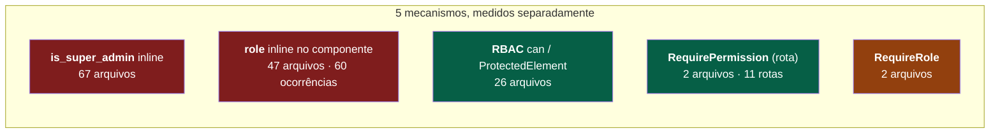
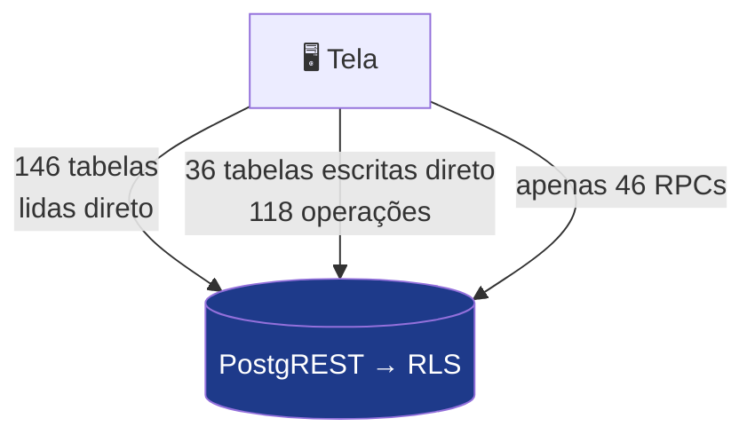

# Funcionalidades do DoctorSaaS e o que entra no controle de permissões

> Levantamento exaustivo de **13/09/2026**, contra `main` e o banco de produção.
> Substitui integralmente a versão anterior deste documento, que foi montada por **amostragem** e por isso precisou de correções seguidas.

---

## Estrutura final — igual ao menu (14/09/2026)

> **Esta seção vale sobre todo o resto do documento.** Foi gerada a partir do banco local depois da última migration. As seções seguintes ficam como histórico das decisões.

**A regra:** módulo = item do menu lateral · grupo = sub-item daquele menu, ou aba daquela tela · na mesma ordem do produto. Se está no menu assim, está na tela de permissões assim — e toda funcionalidade nova entra seguindo a mesma regra.

**138 itens em 9 módulos** · nível 1: 42 · nível 2: 37 · nível 3: 59 · **72 ainda sem portão no código** (marcados "ainda não aplicado" na tela).

Ações: **V** ver · **I** inserir · **E** editar · **X** excluir. ⚑ = entrada (desligada, o que está abaixo dela fica inalcançável). ○ = ainda não aplicado. ↳ = fica dentro do item de cima.

### Dashboard

Indicadores do negócio, incluindo faturamento.

| Grupo | Item | Onde fica | Ações | Nível |
|---|---|---|---|---|
| — | ⚑ Abrir o Dashboard | Menu › Dashboard | V | 1 |
| Abas | ○ Conselho DS (IA) | Dashboard › Diagnóstico executivo › Conselho DS | V | 2 |
|  | Aba Visão Geral | Dashboard › Visão Geral | V | 2 |
|  | Aba Crescimento | Dashboard › Crescimento | V | 2 |
|  | ○ ↳ Ponte de MRR | Dashboard › Crescimento › Ponte de MRR | V | 2 |
|  | Aba Cancelamentos | Dashboard › Cancelamentos | V | 2 |
|  | Aba Vendas | Dashboard › Vendas | V | 2 |
|  | Aba Distribuição | Dashboard › Distribuição | V | 3 |
|  | Aba Customer Success | Dashboard › Customer Success | V | 3 |
|  | Aba Cohort | Dashboard › Cohort | V | 2 |
|  | ○ Aba Meu Painel | Dashboard › Meu Painel | V E | 3 |
| Vale em todo o Dashboard | ○ Ver valores em R$ nos painéis | Todos os painéis com valor em R$ | V | 2 |

### Clientes

A lista de clientes e a ficha de cada um.

| Grupo | Item | Onde fica | Ações | Nível |
|---|---|---|---|---|
| — | ⚑ Abrir Clientes | Menu › Clientes | V I E X | 2 |
| Abas da lista | Exportar a lista | Clientes › botão Exportar XLSX | V | 2 |
|  | ○ Aba Movimentos MRR | Clientes › Movimentos MRR | V | 3 |
|  | ○ Aba Reajustes | Clientes › Reajustes | V I X | 2 |
|  | ○ Aba Divergências Hiper | Clientes › Divergências Hiper | V E | 3 |
|  | ○ Aba Cadastro incompleto | Clientes › Cadastro incompleto | V E | 3 |
|  | ○ Aba Aprovação OEM | Clientes › Aprovação OEM | V | 2 |
| Ficha do cliente | ⚑ ○ Abrir a ficha do cliente | Clientes › abrir um cliente | V | 3 |
|  | ○ ↳ Contatos adicionais | Ficha do cliente › Dados Cadastrais › Contatos adicionais | V I E X | 3 |
|  | ○ Dados cadastrais | Ficha do cliente › Dados Cadastrais | V E | 3 |
|  | ○ Produto e contrato | Ficha do cliente › Produto / Contrato | V | 3 |
|  | ○ ↳ Contratos do cliente | Ficha do cliente › Produto / Contrato › Contratos | V I E X | 2 |
|  | ↳ Produtos e módulos | Ficha do cliente › Produto / Contrato › Produtos & Módulos | V I E X | 2 |
|  | ○ Avisos e bloqueios | Ficha do cliente › Avisos e Bloqueios | V E | 3 |
|  | ○ Tickets do cliente | Ficha do cliente › Tickets | V | 3 |
|  | ○ Filiais do cliente | Ficha do cliente › Filiais | V I E X | 3 |
|  | ○ Aba Financeiro do cliente | Ficha do cliente › Financeiro | V E | 2 |
|  | ↳ Custos e Margens | Ficha do cliente › Financeiro › Parâmetros financeiros | V E | 1 |
|  | ○ Integração | Ficha do cliente › Integração | V E | 3 |
|  | ○ Cancelar cliente | Ficha do cliente › Cancelamento | V | 2 |
|  | ○ Excluir tudo do cliente | Ficha do cliente › Zona de Perigo › Excluir tudo | V | 2 |

### Atendimento

Dashboard de atendimento, Chat e Tickets.

| Grupo | Item | Onde fica | Ações | Nível |
|---|---|---|---|---|
| Dashboard de atendimento | ⚑ Abrir o Dashboard de atendimento | Menu › Atendimento › Dashboard | V | 1 |
|  | Aba Tempo Real | Dashboard de Atendimento › Tempo Real | V | 2 |
|  | Aba Velocidade / SLA | Dashboard de Atendimento › Velocidade | V | 3 |
|  | Aba Agentes | Dashboard de Atendimento › Agentes | V | 2 |
|  | Aba Satisfação | Dashboard de Atendimento › Satisfação | V | 2 |
|  | Aba Volume | Dashboard de Atendimento › Volume | V | 3 |
|  | Aba URA | Dashboard de Atendimento › URA | V | 3 |
|  | Aba Chats | Dashboard de Atendimento › Chats | V | 3 |
|  | Aba Tickets | Dashboard de Atendimento › Tickets | V | 3 |
|  | Aba Backlog | Dashboard de Atendimento › Backlog | V | 3 |
|  | Aba Clientes | Dashboard de Atendimento › Clientes | V | 3 |
|  | Aba Cobertura | Dashboard de Atendimento › Cobertura | V | 3 |
| Chat | ⚑ ○ Abrir o Chat | Menu › Atendimento › Chat | V | 2 |
|  | ○ Filtros Avançados | Botão Filtros no topo da lista de conversas do Chat | V | 3 |
|  | ○ Encerrar e Transferir | Botões Encerrar / Transferir no chat | V | 3 |
|  | Participantes do Grupo | Painel do grupo em Atendimento › Chat | V | 3 |
|  | ○ Assumir conversa da fila | Chat › Fila | V | 3 |
|  | ○ Enviar mensagem | Chat | V | 3 |
|  | ○ Agendar mensagem | Chat › Agendar | V | 3 |
|  | ○ Encaminhar mensagem e mídia | Chat › Encaminhar | V | 2 |
|  | ○ Ver conversa de outro agente | Chat › Histórico do contato | V | 2 |
|  | ○ Acesso remoto (AcessoFast) | Chat › Acesso remoto | V | 2 |
|  | ○ Agenda de contatos do WhatsApp | Chat › Contatos | V | 2 |
|  | ○ Busca em mensagens | Chat › Buscar | V | 3 |
| Tickets | ⚑ ○ Abrir Tickets | Menu › Atendimento › Tickets | V I E X | 2 |
|  | ○ Criar ticket | Tickets › Novo | V | 3 |
|  | ○ Editar ticket | Tickets › Detalhe | V | 3 |
|  | ○ Encerrar ticket | Tickets › Detalhe › Encerrar | V | 3 |
|  | ○ Reabrir ticket | Tickets › Detalhe › Reabrir | V | 3 |
|  | ○ Excluir ticket | Tickets › Detalhe › Excluir | V | 2 |
|  | ○ Transferir responsável | Tickets › Detalhe › Transferir | V | 3 |
|  | ○ Anexos do ticket | Tickets › Detalhe › Anexos | V | 2 |
|  | ○ Menções | Tickets › Menções | V | 3 |

### Customer Success

Saúde e risco da carteira.

| Grupo | Item | Onde fica | Ações | Nível |
|---|---|---|---|---|
| — | ⚑ Abrir Customer Success | Menu › Customer Success | V | 1 |

### Implantação

Kanban, dashboard e configuração das jornadas.

| Grupo | Item | Onde fica | Ações | Nível |
|---|---|---|---|---|
| — | ⚑ ○ Abrir Implantação | Menu › Implantação | V | 2 |
| Kanban | ○ Mover cartão de etapa | Implantação › Kanban | V | 3 |
|  | ○ Criar jornada | Implantação › Nova jornada | V | 3 |
|  | ○ Editar dados da jornada | Implantação › Jornada › Editar | V | 3 |
|  | ○ Go-live / encerrar jornada | Implantação › Jornada › Go-live | V | 2 |
|  | ○ Cancelar jornada | Implantação › Jornada › Cancelar | V | 2 |
|  | ○ Reabrir jornada | Implantação › Jornada › Reabrir | V | 2 |
|  | ○ Transferir responsável | Implantação › Jornada › Transferir | V | 3 |
|  | ○ Treinos | Implantação › Treinos | V | 3 |
| Dashboard | ○ Dashboard de Implantação | Implantação › Dashboard | V | 2 |
| Configuração | ○ Aba Jornadas | Implantação › Configuração › Jornadas | V I E X | 3 |
|  | ○ ↳ Checklist das etapas | Implantação › Configuração › Pipelines & Etapas › Checklist | V I E X | 3 |
|  | ○ Aba Pipelines & Etapas | Implantação › Configuração › Pipelines & Etapas | V I E X | 2 |
|  | ○ Aba Distribuição | Implantação › Configuração › Distribuição | V E | 3 |
|  | ○ Aba Motivos de Parada | Implantação › Configuração › Motivos de Parada | V I E X | 3 |
|  | ○ Aba Tipos de demanda | Implantação › Configuração › Tipos de demanda | V I E X | 3 |
|  | ○ ↳ Aplicar template de pipeline | Implantação › Configuração › Pipelines & Etapas › Aplicar template | V I E X | 3 |
|  | ○ Aba Tipos de treino | Implantação › Configuração › Tipos de treino | V I E X | 3 |
|  | ○ Aba Papéis | Implantação › Configuração › Papéis | V I E X | 3 |
|  | ○ Aba Retorno ao vendedor | Implantação › Configuração › Retorno ao vendedor | V I E X | 3 |
|  | ○ Aba Dados da contabilidade | Implantação › Configuração › Dados da contabilidade | V E | 3 |
|  | ○ Aba Indicadores | Implantação › Configuração › Indicadores | V E | 3 |

### Certificados A1

Certificados digitais dos clientes.

| Grupo | Item | Onde fica | Ações | Nível |
|---|---|---|---|---|
| — | ⚑ Abrir Certificados A1 | Menu › Certificados A1 | V | 1 |
| Abas | ○ Aba Dashboard | Certificados A1 › Dashboard | V | 3 |

### Painel de Uso

Consumo da plataforma pela empresa.

| Grupo | Item | Onde fica | Ações | Nível |
|---|---|---|---|---|
| — | ⚑ Abrir o Painel de Uso | Menu › Painel de Uso | V | 1 |

### Configurações

Na mesma divisão da barra lateral de Configurações.

| Grupo | Item | Onde fica | Ações | Nível |
|---|---|---|---|---|
| — | ⚑ Abrir Configurações | Menu › Configurações | V | 1 |
| Sistema | Geral | Configurações › Sistema › Geral | V E | 1 |
|  | Théo | Configurações › Sistema › Théo | V E | 1 |
|  | Guia de configuração | Configurações › Sistema › Guia de configuração | V | 1 |
| Financeiro | Percentuais | Configurações › Financeiro › Percentuais | V I E X | 1 |
|  | Despesas CAC | Configurações › Financeiro › Despesas CAC | V I E X | 1 |
| Cadastros · Comercial | Produtos | Configurações › Cadastros › Comercial › Produtos | V I E X | 1 |
|  | Fornecedores | Configurações › Cadastros › Comercial › Fornecedores | V I E X | 1 |
|  | Modelos de contrato | Configurações › Cadastros › Comercial › Modelos de contrato | V I E X | 1 |
|  | Origens de venda | Configurações › Cadastros › Comercial › Origens de venda | V I E X | 1 |
|  | Formas de pagamento | Configurações › Cadastros › Comercial › Formas de pagamento | V I E X | 1 |
| Cadastros · Operacional | Setores | Configurações › Cadastros › Operacional › Setores | V I E X | 1 |
|  | Funcionários | Configurações › Cadastros › Operacional › Funcionários | V I E X | 1 |
|  | Tickets | Configurações › Cadastros › Operacional › Tickets | V I E X | 1 |
| Cadastros · Serviços | Categorias | Configurações › Cadastros › Serviços › Categorias | V I E X | 1 |
|  | Tipos de serviço | Configurações › Cadastros › Serviços › Tipos de serviço | V I E X | 1 |
| Cadastros · Classificação | Segmentos | Configurações › Cadastros › Classificação › Segmentos | V I E X | 1 |
|  | Áreas de atuação | Configurações › Cadastros › Classificação › Áreas de atuação | V I E X | 1 |
|  | Unidades base | Configurações › Cadastros › Classificação › Unidades base | V I E X | 1 |
| Cadastros · Ciclo de vida | Motivos de cancelamento | Configurações › Cadastros › Ciclo de vida › Motivos de cancelamento | V I E X | 1 |
|  | Motivos de pausa | Configurações › Cadastros › Ciclo de vida › Motivos de pausa | V I E X | 1 |
| Equipe | ↳ Convidar pessoas | Configurações › Equipe › Acessos & permissões › botão Convidar | V I E X | 2 |
|  | ↳ Trocar o grupo de outra pessoa | Configurações › Equipe › Acessos & permissões › coluna Grupo | V E | 2 |
|  | ○ ↳ Desativar pessoa | Configurações › Equipe › Acessos & permissões › Status | V | 2 |
|  | ○ ↳ Histórico de alterações | Configurações › Equipe › Acessos & permissões › Histórico | V | 3 |
|  | Acessos & permissões | Configurações › Equipe › Acessos & permissões | V E | 1 |
|  | Permissões e papéis | Configurações › Equipe › Permissões e papéis | V E | 1 |
|  | Segurança | Configurações › Equipe › Segurança | V E | 1 |
| Atendimento | ○ ↳ Macros e respostas rápidas | Configurações › Atendimento › Operação › Macros | V I E X | 3 |
|  | Canais | Configurações › Atendimento › Canais | V E | 1 |
|  | Distribuição | Configurações › Atendimento › Distribuição | V E | 1 |
|  | Operação | Configurações › Atendimento › Operação | V E | 1 |
|  | E-mail | Configurações › Atendimento › E-mail | V E | 1 |
|  | Inteligência artificial | Configurações › Atendimento › Inteligência artificial | V E | 1 |
|  | Horário & plantão | Configurações › Atendimento › Horário & plantão | V E | 1 |
|  | Base de conhecimento | Configurações › Atendimento › Base de conhecimento | V I E X | 1 |
| Dados | Duplicidades | Configurações › Dados › Duplicidades | V | 1 |
|  | Importação | Configurações › Dados › Importação | V | 1 |
| Integrações | Omie | Configurações › Integrações › Omie | V E | 1 |
|  | Hiper | Configurações › Integrações › Hiper | V E | 1 |
|  | OEM | Configurações › Integrações › OEM | V E | 1 |

### Super Admin

Visão entre empresas. Só super admin chega aqui, independentemente do grupo.

| Grupo | Item | Onde fica | Ações | Nível |
|---|---|---|---|---|
| — | ⚑ ○ Abrir Super Admin | Menu › Super Admin | V | 3 |
| Telas | ○ Monitor | Super Admin › Monitor | V | 3 |
|  | ○ Tenants | Super Admin › Tenants | V | 3 |
|  | ○ Templates | Super Admin › Templates | V | 3 |
|  | ○ Limpeza de URAs | Super Admin › Limpeza de URAs | V | 3 |

### De-para: as funcionalidades das versões anteriores deste documento

Nenhuma funcionalidade listada aqui antes se perdeu. As chaves que não existem mais foram para um destes destinos:

| Chave antiga | Destino | Motivo |
|---|---|---|
| `dash.financeiro`, `dash.operacional`, `dash.conselho` | uma linha por aba do Dashboard + `dashboard_conselho` | o agrupamento foi recusado: catálogo completo, o nível decide o que aparece |
| `atd.operacional` | as 11 abas do Dashboard de atendimento | idem |
| `onb.config` | as 10 abas reais de Implantação › Configuração | idem |
| `onb.quadro` | `nav.onboarding` (entrada de Implantação) | duplicata: era a mesma tela |
| `nav.chat` · `nav.clientes` · `nav.tickets` | `atendimento_chat` · `clientes` · `tickets` | duplicata; o código foi repontado |
| `cs.painel` · `certificados` · `painel_uso` | `nav.customer_success` · `nav.certificados_a1` · `nav.painel_uso` | duplicata |
| `meu_painel` · `nav.meu_painel` | `dash.meu_painel` | duplicata |
| `ia_configuracoes` · `whatsapp_instancias` · `base_conhecimento` · `parametros_atendimento` | `cfg.ia` · `cfg.canais` · `cfg.kb` · `cfg.operacao` | duplicata da aba de Configurações |
| `fin.mrr` (Receita e MRR) | **removido** — o MRR passa a seguir as portas de Clientes e do Dashboard | era uma trava sobre `movimentos_mrr`, lida direto por 9 lugares: quem abria Clientes com ela negada via o MRR vazio, sem aviso |
| `clientes.reativar` | **removido** | não existe em tela nenhuma (`reativar_cliente` não é chamada pelo frontend) |
| `clientes.historico` | **removido** | não fica na ficha: é o histórico de permissões, duplicata de `usuarios.auditoria` |

**Entraram** com a regra do menu: as abas da lista de Clientes que faltavam (Divergências Hiper, Cadastro incompleto), as seções reais da ficha (Dados Cadastrais, Produto / Contrato, Avisos e Bloqueios, Tickets, Integração), as 6 abas de Implantação › Configuração que faltavam, a aba Dashboard de Certificados A1 e `cfg.integracoes_oem` — a aba OEM usava a permissão do Omie, e liberar um liberava o outro.

---

## 0. Método — e por que a versão anterior errava

As correções sucessivas tiveram uma causa única: **eu media uma fonte e concluía sobre o sistema todo.** Varri `src/` e afirmei que o recurso do OEM não protegia nada — ele protege 10 funções no banco. Olhei `clientes` e afirmei que o escopo por unidade existia em uma tabela — existe em cinco.

Nesta versão o levantamento cruza **seis fontes**, e o que não foi medido está declarado como não medido.

| # | Fonte | O que dá | Como foi extraído |
|---|---|---|---|
| 1 | `src/App.tsx` | 31 rotas e o guardião de cada uma | leitura linha a linha, não regex |
| 2 | Componentes de página | abas e seções | `TabsTrigger` + seções da ficha |
| 3 | `resources` (produção) | as 66 chaves atuais | SQL |
| 4 | `src/**` | os 5 mecanismos de controle | grep por cada mecanismo, contado separadamente |
| 5 | `pg_proc` / `pg_policies` | guardas que vivem no banco | SQL |
| 6 | Chamadas `.from()` / `.rpc()` | superfície de dados e de ações | parser multilinha |

**O que NÃO foi medido, e por isso não afirmo:** Edge Functions (87) não foram auditadas quanto a permissão — elas usam `service_role` e ignoram RLS por definição, então ficam fora deste escopo e entram na F6 do plano. Também não medi o que cada uma das 60 checagens de papel embutidas nos componentes esconde na tela — sei onde estão e quantas são, não o efeito visual de cada uma.

---

## 1. A descoberta que reordena o projeto

O DoctorSaaS **já tem controle de acesso**. Só que o RBAC é a menor parte dele.

> **Leia assim:** o verde é o sistema que a tela de permissões controla. O vermelho é **código escrito à mão, espalhado, que nenhum admin consegue configurar.** Hoje o vermelho é quase o dobro do verde.

Trocar `role` por grupos **não conserta o vermelho sozinho** — 47 arquivos comparam `profile.role === 'admin'` e continuarão comparando. É por isso que a decisão D8 do plano (todo grupo declara um nível base) existe: sem ela, criar o grupo *Financeiro1* não muda o comportamento desses 47 arquivos.

### O segundo fato que muda o desenho

**Não existe camada de API neste sistema.** A tela conversa com 146 das 148 tabelas diretamente. Consequência inescapável:

> **RLS não é "uma das opções" de onde colocar a permissão. É o único lugar possível.** E como RLS custa em toda consulta, cada policy nova é uma decisão de performance — o que torna o critério de inclusão da seção 2 uma restrição técnica, não uma preferência.

---

## 2. O critério: o que justifica entrar no controle

Um catálogo grande demais falha por dois motivos ao mesmo tempo — a tela de configuração fica impossível de operar, e as policies pesam em cada consulta. Como **performance e usabilidade são premissa do produto**, o critério tem que **cortar**, não acumular.

### Entra se marcar pelo menos um

| Marca | Critério | Exemplo |
|---|---|---|
| 🔒 **D** | Expõe dado pessoal de terceiro (LGPD) | conversas, contatos, anexos, exportação |
| 💰 **R$** | Expõe ou altera dinheiro | MRR, margem, comissão, faturamento |
| ⛔ **!** | É irreversível | excluir cliente, cancelar contrato, importar em massa |
| ⚡ **OP** | Afeta o trabalho de outras pessoas | instância de WhatsApp, distribuição, pipelines |
| 🔑 **PRIV** | Permite escalar privilégio | papéis, permissões, convites |
| 💸 **$$** | Gera custo direto | configurações de IA |

### NÃO entra — e recusar é parte do trabalho

| Não entra | Por quê |
|---|---|
| Aba que só **filtra ou recorta** o que a pessoa já pode ver | Dois cadeados para a mesma informação. Custo de tela sem ganho |
| Ação que **é o trabalho** da pessoa (enviar mensagem, abrir ticket) | Se ela não pode, ela não deveria ter o módulo |
| Preferência **pessoal** (tema, colunas, Meu Painel) | É do próprio usuário por natureza |
| Leitura de **catálogo** (cidades, estados, tipos) | Sem valor para quem ataca, custo em toda consulta |
| Qualquer controle que exija **join em tabela quente** | `whatsapp_messages` tem 387 mil linhas. Protege-se a conversa, não a mensagem |

### ✅ Decisão de 13/09/2026: o catálogo fica COMPLETO — quem corta é o nível

Uma versão anterior desta seção usava o critério para **descartar ~100 candidatos**. O owner decidiu o contrário, e a decisão é melhor:

> **O catálogo carrega tudo (~185 recursos). O admin escolhe um _nível de controle_ por módulo, e o nível decide quanto disso aparece.**

| Nível | Mostra | Custo de banco |
|---|---|---|
| **1 — Normal** | navegação + configurações (~45) — **a tela de hoje, exatamente** | zero |
| **2 — Moderado** | + módulos e ações marcados 💰 🔒 ⛔ + `excluir` nos críticos | policies nas tabelas sensíveis |
| **3 — Completo** | + abas, sub-ações, CRUD completo e **escopo por linha** | + policies de escopo e índices |

As marcas do critério **não somem** — elas deixam de ser filtro e viram a **etiqueta que define em que nível cada recurso aparece**. Continuam sendo a justificativa obrigatória de cada linha.

**Isto já existe no código, travado em duas constantes.** `PermissoesPapeisContent.tsx` tem `SCREEN_ONLY = true` e `CRUD_ENABLED = false` — juntas, elas **são** o nível 1. Medido: a tela mostra **45 dos 66** recursos; **17 são invisíveis para o admin**, entre eles `clientes.exportar`, `clientes.oem_aprovacao`, `atendimento_chat` e `usuarios_roles`.

🔎 **Correção:** uma versão anterior afirmou que "14 recursos aparecem na tela e não fazem nada". **Errado** — só `nav.emails` aparece. O problema real é o inverso e maior: **17 recursos existem, alguns funcionam, e o admin não os enxerga.**

**Por que isso não briga com a premissa de performance:** *recurso é barato, policy é cara*. Um recurso custa +1 linha num mapa que roda 1× por sessão e fica 5 min em cache. Só vira custo de banco quando alguém escreve uma policy — e isso segue restrito a 8–12 tabelas, tenha o catálogo 87 ou 185 itens. **O escopo de linha vive só no nível 3**, então quem paga o custo é quem pediu.

---

## 3. Inventário completo — as 31 rotas

Todas as rotas do sistema, com o guardião real de cada uma. Verificado linha a linha em `App.tsx`.

| Rota | Protegida hoje por | Situação |
|---|---|---|
| `/login` `/signup` `/forgot-password` `/reset-password` | — (pública) | ✅ correto |
| `/onboarding` `/access-pending` `/access-blocked` | `AuthGuard` | ✅ correto |
| `/dashboard` | `nav.dashboard` | ✅ |
| `/clientes` · `/clientes/novo` · `/clientes/:id` | `nav.clientes` | ✅ |
| `/certificados-a1` | `nav.certificados_a1` | ✅ |
| `/configuracoes` · `/configuracoes/notificacoes` | `nav.configuracoes` | ✅ |
| `/customer-success` | `nav.customer_success` | ✅ |
| `/atendimento/dashboard` | `nav.atendimento_dashboard` **+ `RequireRole(admin,head)`** | ⚠️ **portão duplo** |
| `/whatsapp` | `nav.chat` | ✅ |
| `/whatsapp/contatos` | `nav.chat` | ⚠️ **compartilha a chave do chat** |
| `/tickets` | `nav.tickets` | ✅ |
| `/painel-uso` | `nav.painel_uso` | ✅ |
| `/admin/limpeza-uras` | `AuthGuard` + checagem de papel **dentro** do componente | ⚠️ fora do catálogo |
| `/onboarding-implantacao` (+ `/config`, `/dashboard`) | `OnboardingGuard` (flag do tenant) | 🔴 **sem permissão nenhuma** |
| `/super/tenants` (+ `/:id`) · `/super/monitor` · `/super/templates` | `SuperAdminGuard` | ✅ por desenho (D4) |
| `/cadastros` · `/settings/users` · `/whatsapp/settings` | redirecionam para Configurações | ✅ herdam o destino |

**Três achados novos desta varredura:**

1. 🔴 **`/atendimento/dashboard` tem portão duplo e contraditório.** Mesmo concedendo `nav.atendimento_dashboard` a um operador, o `RequireRole(["admin","head"])` o barra. A tela de permissões oferece uma chave que não abre a porta. **Corrigir na F3: o `RequireRole` sai, o recurso manda.**
2. ⚠️ **Contatos do WhatsApp usa a chave do chat.** Não é possível dar chat sem dar a agenda inteira de contatos — que é dado pessoal em volume.
3. ✅ **`/admin/limpeza-uras` não está exposta** (checa papel por dentro), mas é uma tela destrutiva fora do catálogo.

---

## 4. Inventário completo — telas, abas e seções

Extraído dos componentes. Este é o universo de ~185 candidatos, do qual o critério seleciona.

| Módulo | Abas / seções | Fonte |
|---|---|---|
| **Dashboard** | 8: Visão Geral · Crescimento · Cancelamentos · Vendas · Distribuição · Customer Success · Cohort · Meu Painel | `Dashboard.tsx` |
| **Dashboard de Atendimento** | 11: Tempo Real · Velocidade/SLA · Agentes · Satisfação · Volume · URA · Chats · Tickets · Backlog · Clientes · Cobertura | `AtendimentoDashboard.tsx` |
| **Clientes — lista** | 20+ filtros (Setup, Recorrência, Produto, Origem, Segmento, Mensalidade, Lucro…) | `Clientes.tsx` |
| **Clientes — ficha** | 10 seções: Dados · Venda/Produto · Contratos · Produtos · Financeiro (card e aba) · Filiais · Tickets · Integração · Parâmetros de Atendimento | `ClienteForm.tsx` |
| **Configurações** | 37 abas mapeadas em `SECTION_TO_RESOURCE` | `SettingsSidebar.tsx` |
| ↳ Integrações | Omie 5 · Hiper 6 · OEM 2 · Tickets 2 = 15 sub-abas | componentes de integração |
| **Onboarding — config** | 10: Jornadas · Pipelines & Etapas · Distribuição · Motivos de Parada · Tipos de demanda · Tipos de treino · Papéis · Retorno ao vendedor · Dados da contabilidade · Indicadores | `OnboardingConfigPage.tsx` |
| **Onboarding — SLA** | 4: Por Pipeline · Por Etapa · Por Responsável · Por Área | `OnboardingSlaOverview.tsx` |
| **Onboarding — quadros** | Implantação · Acompanhamento · jornada · treinos · transferência · go-live | `pages/onboarding/` |
| **Certificados A1** | 2: Lista · Dashboard | `CertificadosA1.tsx` |
| **Chat / WhatsApp** | 154 arquivos — chat, fila, grupos, agendadas, macros, mídia, busca, URA, acesso remoto | `components/whatsapp/` |
| **Tickets** | lista, detalhe, anexos, menções, status por setor, tags | `components/tickets/` |
| **Customer Success** | 5 blocos | `CustomerSuccess.tsx` |
| **Super Admin** | tenants · detalhe · monitor · templates · limpeza de URAs | `pages/super/`, `pages/admin/` |

---

## 5. O catálogo proposto — ≈87 recursos

Aplicando o critério da seção 2. **A coluna "Por quê" é obrigatória: recurso sem justificativa não entra.**

### 5.1 Navegação — 11 recursos

Custo zero em performance (nunca viram policy) e é o mapa que o admin usa para montar um grupo.

`nav.dashboard` · `nav.clientes` · `nav.certificados_a1` · `nav.atendimento_dashboard` · `nav.customer_success` · `nav.chat` · `nav.tickets` · `nav.painel_uso` · `nav.configuracoes` · 🆕 `nav.onboarding` · 🆕 `nav.super`

❌ **`nav.emails` sai da tela** (`hidden = true`) até a rota existir — feature em construção, migration de 10/09/2026.

### 5.2 Dashboard — 8 abas viram **4** recursos

| Recurso | Cobre | Por quê | Escopo |
|---|---|---|---|
| `dash.financeiro` | Crescimento · Cancelamentos · Cohort · Métricas Financeiras | 💰 | todos / unidade |
| `dash.vendas` | Vendas | 💰 comissão | todos / unidade |
| `dash.operacional` | Visão Geral · Distribuição · Customer Success | — (porta de entrada) | todos / unidade |
| `dash.conselho` | Conselho DS (IA) | 💸 | todos |

❌ **Meu Painel não vira recurso** — é sempre do próprio usuário.
**Por que 4 e não 10:** as quatro abas financeiras se protegem pela mesma decisão. Quem pode ver MRR vê as quatro; quem não pode, não vê nenhuma. Quatro cadeados separados seriam quatro chances de configurar errado.

### 5.3 Clientes — 8 recursos

| Recurso | Por quê | Ações | Escopo |
|---|---|---|---|
| `clientes` | porta do módulo | ver, criar, editar | todos / **unidade** |
| `clientes.exportar` | 🔒 base pessoal saindo do sistema | — | herda |
| `clientes.custos` | 💰 margem | ver, editar | todos |
| `clientes.contratos` | 💰 mexe no MRR | ver, criar, editar | todos |
| `clientes.cancelar` | ⛔💰 | — | todos / unidade |
| `clientes.purge` | ⛔ irreversível | — | todos |
| `clientes.modulos` | ⚡ OEM | ver, editar | todos |
| `clientes.oem_aprovacao` | ⚡💰 | — | todos |

❌ **As outras 7 seções da ficha não viram recurso.** Quem pode abrir o cliente precisa de Dados, Filiais, Tickets e Contatos para trabalhar. Cadeado ali é atrito sem ganho.
⚠️ **Escopo `próprio` em clientes segue impossível** — a única coluna candidata (`funcionario_id`) é DEPRECATED.

### 5.4 Atendimento — 6 recursos

| Recurso | Por quê | Escopo |
|---|---|---|
| `atendimento_chat` | 🔒 **387 mil mensagens de clientes reais** | **todos / setor / próprio** |
| `atend.historico_terceiros` | 🔒 ver conversa de outro agente | todos / setor |
| `atend.encaminhar` | 🔒 tira mídia do sistema | — |
| `atend.contatos` | 🔒 agenda inteira — **hoje presa a `nav.chat`** | todos |
| `atendimento_transferir` | ⚡ mexe na fila | próprio / setor |
| `atend.macros` | ⚡ texto que todos usam | todos / setor |

❌ **Não entram:** filtros avançados, enviar mensagem, agendar, participantes de grupo, busca. São o trabalho.
🔴 **`atendimento_chat` com escopo é a permissão mais valiosa do sistema.** Hoje qualquer operador com chat lê a conversa de qualquer cliente com qualquer colega.

### 5.5 Dashboard de Atendimento — 11 abas viram **3** recursos

| Recurso | Cobre | Por quê | Escopo |
|---|---|---|---|
| `atd.operacional` | Tempo Real · Velocidade · Volume · URA · Chats · Tickets · Backlog · Clientes · Cobertura | porta do módulo | todos / setor |
| `atd.agentes` | Agentes | 🔒 produtividade individual | **todos / setor / próprio** |
| `atd.satisfacao` | Satisfação | 🔒 nota individual | **todos / setor / próprio** |

**Por que 3 e não 11:** só duas abas expõem desempenho de pessoa. As outras nove são a mesma operação recortada de formas diferentes.
⚠️ E o `RequireRole` da rota precisa sair, senão nada disso se aplica a operador.

### 5.6 Tickets — 4 recursos

| Recurso | Por quê | Escopo |
|---|---|---|
| `tickets` | porta | todos / **unidade / setor** / próprio ⚠️ |
| `tickets.excluir` | ⛔ | todos |
| `tickets.anexos` | 🔒 arquivo de cliente | herda |
| `tickets.transferir` | ⚡ | setor |

⚠️ **`support_tickets` não tem `assigned_to`** — `unidade` e `setor` saem da tabela; `próprio` exige join com `support_attendances` e fica para depois.

### 5.7 Onboarding — 17 candidatos viram **6** recursos

| Recurso | Cobre | Por quê | Escopo |
|---|---|---|---|
| `onb.quadro` | Implantação e Acompanhamento | porta | todos / unidade / próprio |
| `onb.golive` | encerrar jornada | ⛔ fecha SLA | próprio / setor |
| `onb.cancelar` | cancelar / desistência | ⛔ | setor |
| `onb.reabrir` | reabrir | ⛔ reescreve histórico | todos |
| `onb.dashboard` | dashboard e SLA (4 abas) | — | todos / unidade |
| `onb.config` | **as 10 abas de configuração** | ⚡ muda a regra de todo mundo | todos |

**Por que 1 recurso para 10 abas de config:** quem configura pipeline configura etapa, checklist e papel. Separar cria dez chances de errar e zero ganho real.

### 5.8 Configurações — as 37 atuais permanecem

Já existem, já funcionam, já são editáveis por tenant. Removê-las seria regressão. **Duas mudanças apenas:**

1. 🔴 **Ação `excluir` separada** em `cfg.produtos`, `cfg.fornecedores` e `cfg.modelos_contrato`. Hoje só existe `ver` — quem enxerga a aba pode **apagar um produto**, e apagar produto mexe em contrato e em MRR.
2. Agrupamento visual por `parent_key`, com a cascata da decisão D7.

### 5.9 Equipe, segurança e privilégio — 5 recursos

| Recurso | Por quê |
|---|---|
| `cfg.acessos` | 🔑 |
| `cfg.permissoes` | 🔑 **anti-lockout obrigatório** |
| `cfg.seguranca` | 🔑 |
| `usuarios_convites` | 🔑 hoje **sem portão** |
| `usuarios_roles` | 🔑 hoje **sem portão** — escalada de privilégio |

### 5.10 Operação e custo — 4 recursos

| Recurso | Por quê |
|---|---|
| `whatsapp_instancias` | ⚡ desconectar derruba o atendimento — hoje **sem portão** |
| `ia_configuracoes` | 💸 dinheiro — hoje **sem portão** |
| `cfg.importacao` | ⛔🔒 |
| `cfg.duplicidades` | ⛔ funde cadastros |

### 5.11 Demais módulos — 3 recursos

`certificados` (dado fiscal do cliente) · `cs.painel` · `painel_uso`

---

## 6. Orçamento de performance

Cada recurso tem dois custos, e eles são de naturezas diferentes.

| Custo | Tamanho | Observação |
|---|---|---|
| **+1 linha no mapa de permissões** | irrelevante | 66 → 87 linhas numa consulta que já roda 1× por sessão e fica 5 min em cache |
| **+1 policy de RLS** | **relevante** | roda em **toda** consulta àquela tabela |

Por isso a regra: **recurso é barato, policy é cara.** Dos 87 recursos, **apenas os que protegem dado sensível viram policy** — a estimativa é de 8 a 12 tabelas, não 146.

Regras técnicas que vêm do levantamento:

1. `(SELECT has_perm(...))` — sempre envolvido, para rodar 1× por consulta e não 1× por linha. **254 das 466 policies já usam esse padrão.**
2. `AS RESTRICTIVE` — sempre. Policy permissiva **amplia** acesso, em silêncio.
3. Índice **antes** da policy, `CONCURRENTLY`, fora do pico.
4. **`whatsapp_messages` fica de fora.** 387 mil linhas, e só tem `conversation_id`. Proteger a conversa fecha o acesso na prática.
5. `EXPLAIN ANALYZE` antes e depois, por tabela.

## 7. Orçamento de usabilidade

A tela de permissões mostra recursos × grupos. Com 87 recursos e 5 grupos são 435 células.

- **Agrupar por módulo com recolher/expandir** — o `parent_key` já existe e a tela já lê a coluna.
- **Cascata pai→filho** (decisão D7) — desmarcar "Clientes" desmarca os filhos.
- **Duplicar grupo** — configurar *Financeiro1* é ajustar 2 caixas a partir do *Financeiro*, nunca marcar 87.
- **Só `ver` por padrão.** `criar`/`editar`/`excluir` aparecem apenas nos recursos onde a distinção importa — hoje a tela já faz isso (`CRUD_ENABLED = false`).

> Se a tela de permissões ficar difícil de operar, o admin desiste e libera tudo. **Aí o RBAC piora a segurança em vez de melhorar.**

---

## 8. O que mudou em relação à versão anterior deste documento

| Antes | Agora | Motivo |
|---|---|---|
| ~140 recursos | **≈87** | Critério de inclusão aplicado; ~100 candidatos descartados |
| Dashboard com 10 recursos | **4** | Abas financeiras se protegem juntas |
| Dashboard de Atendimento com 13 | **3** | Só produtividade individual justifica |
| Onboarding com 17 | **6** | As 10 abas de config são uma decisão só |
| "Dashboard não tem cadeado nenhum" | confirmado, **com a causa** | As checagens de papel nas abas alimentam só o modal de Diagnóstico |
| `próprio` para clientes | **removido** | Única coluna é DEPRECATED |
| Contatos do WhatsApp "sem recurso" | **usa `nav.chat`** | Verificado em `App.tsx` |
| — | 🆕 **portão duplo em `/atendimento/dashboard`** | `RequireRole` anula o recurso |
| — | 🆕 **5 mecanismos de controle, RBAC é o 3º** | 47 arquivos com papel embutido × 26 com RBAC |
| — | 🆕 **146 tabelas acessadas direto pela tela** | Define o RLS como único ponto de controle |

---

## 9. Status das decisões

| # | Pergunta | Resposta |
|---|---|---|
| 1 | Cortar o catálogo pelo critério? | ❌ **Não.** Catálogo completo + nível de controle (D10) |
| 2 | Agrupar as 11 abas do Dashboard de Atendimento? | ❌ **Não.** Todas entram; o nível decide o que aparece |
| 3 | Agrupar as 10 abas de config do Onboarding? | ❌ **Não.** Mesma razão |
| 4 | Tirar o `RequireRole` de `/atendimento/dashboard`? | ⏸️ **EM ABERTO** — hoje ele anula a permissão concedida |
| 5 | Contatos do WhatsApp com chave própria? | ✅ **Sim** — decorre do catálogo completo |

**As seções 5.2 a 5.11 abaixo descrevem o agrupamento que foi recusado.** Elas continuam no documento porque registram, recurso a recurso, **a justificativa** (💰 🔒 ⛔ ⚡ 🔑 💸) — que agora define o **nível** de cada um, não mais se ele entra. Onde se lê "8 abas viram 4 recursos", leia "as 8 entram; 4 no nível 2, as demais no nível 3".
